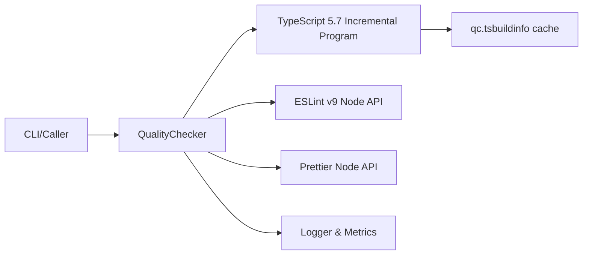

# Quality Checker — Technical Design (TypeScript + ESLint v9 + Prettier)

**Version:** 1.0 • **Owner:** Nathan • **Date:** 2025-09-06

---

## 1) Architecture

- **Coordinator (`QualityChecker`)** orchestrates three engines:
  - **TypeScript Engine**: TS 5.7+ incremental, file-scoped.
  - **ESLint Engine**: ESLint v9 Node API (flat config) with cache.
  - **Prettier Engine**: Prettier Node API with `resolveConfig()` and ignore
    support.
- **GitIntegration**: discovers staged/changed files and honors `.gitignore`.
- **SafeFileOperations**: safe writes for autofixes.
- **Logger**: `@orchestr8/logger` structured events per checker and aggregate.



---

## 2) Data Contracts

### 2.1 Aggregated result

```ts
type Severity = 'error' | 'warning'

export interface Issue {
  tool: 'ts' | 'eslint' | 'prettier'
  file?: string
  line?: number
  col?: number
  code?: string // TS2307, no-unused-vars, etc.
  severity: Severity
  message: string
}

export interface QualityCheckResult {
  success: boolean
  duration: number
  errors: string[]
  warnings: string[]
  autofixes: string[]
  checkers: Record<string, CheckerResult>
  correlationId?: string
}
```

### 2.2 Per-checker

```ts
export interface CheckerResult {
  success: boolean
  errors: string[]
  warnings?: string[]
  autofixes?: string[]
  duration?: number
  fixable?: boolean
}
```

---

## 3) TypeScript Engine (file-scoped incremental)

### 3.1 Algorithm

1. Resolve `tsconfig.json` (nearest up-tree or provided path).
2. `cacheDir = env.QC_TS_CACHE_DIR || os.tmpdir()/quality-check-ts-cache`;
   ensure dir exists.
3. Set `process.env.NODE_COMPILE_CACHE = cacheDir`.
4. Build incremental program:
   ```ts
   const host = ts.createIncrementalCompilerHost(options)
   const program = ts.createIncrementalProgram({
     rootNames: [abs(targetFile)],
     options: {
       ...tsconfig,
       noEmit: true,
       incremental: true,
       tsBuildInfoFile: path.join(cacheDir, 'qc.tsbuildinfo'),
       skipLibCheck: true,
     },
     host,
   })
   ```
5. Collect diagnostics: `syntactic`, `semantic`, `options`.
6. Normalize and **filter** to the target file (keep options diagnostics without
   `file`).
7. Format: `file:line:col - message (TSxxxx)`.

### 3.2 Performance

- **Cold**: parses the target file + its imports.
- **Warm**: reuses graph/state via `qc.tsbuildinfo` — typical ≤ 300ms.

### 3.3 Failure modes

- Missing tsconfig → warn & skip TS.
- Parser errors → error with `TSxxxx` code.
- Path alias mismatch → surfaced as TS2307; caller action item.

---

## 4) ESLint Engine (v9 flat config, Node API)

### 4.1 Setup

```ts
import { ESLint } from 'eslint'

const eslint = new ESLint({
  cwd: process.cwd(),
  fix: options.fix,
  cache: true,
  cacheLocation: options.cacheDir ?? '.cache/eslint',
  errorOnUnmatchedPattern: false,
  // Flat config is default in v9; ensure `eslint.config.js` at repo root.
})
```

### 4.2 Run & format

```ts
const results = await eslint.lintFiles(files)
if (options.fix) await ESLint.outputFixes(results)
const formatter = await eslint.loadFormatter(
  options.format === 'json' ? 'json' : 'stylish',
)
const output = await formatter.format(results)
if (output.trim()) process.stderr.write(output)
```

### 4.3 Notes

- Move `.eslintignore` patterns into `eslint.config.js` `ignores`.
- Reuse a single `ESLint` instance per run for perf.

---

## 5) Prettier Engine (Node API)

### 5.1 Check/format flow

```ts
import * as prettier from 'prettier'
import * as fs from 'node:fs/promises'

const info = await prettier.getFileInfo(file, { ignorePath: '.prettierignore' })
if (!info.ignored && info.inferredParser) {
  const cfg = await prettier.resolveConfig(file)
  const src = await fs.readFile(file, 'utf8')
  const ok = await prettier.check(src, { ...cfg, filepath: file })
  if (!ok) {
    if (options.fix) {
      const out = await prettier.format(src, { ...cfg, filepath: file })
      await fs.writeFile(file, out, 'utf8')
      autofixes.push(`Prettier formatted: ${rel(file)}`)
    } else {
      errors.push(`${file}: needs formatting`)
    }
  }
}
```

### 5.2 Notes

- Always pass `filepath` so Prettier selects the right parser.
- Skip unknown/binary files (no parser).

---

## 6) Logging & Metrics

Emit per-check and aggregate events via `@orchestr8/logger`:

```ts
logger.debug('checker.complete', {
  component: 'ts' | 'eslint' | 'prettier',
  durationMs,
  fileCount,
  errorCount,
  warningCount,
  formattedCount,
  cacheDir, // TS only
  correlationId,
})
```

Aggregate:

```ts
logger.debug('qc.complete', { durationMs, success, errorCount, warningCount })
```

---

## 7) CLI Options & Discovery

- `--staged` / `--since <ref>`: use `GitIntegration` to enumerate files.
- Respect `.gitignore` before invoking engines.
- `--format stylish|json`; JSON prints an issues array with
  `{tool,file,line,col,code,severity,message}`.

---

## 8) Testing

- **Unit**: path normalization, message mapping, ignore handling.
- **Integration**: fixture repo with path aliases; assert TS2307 shows when
  alias missing.
- **Perf**: cold vs warm timings, logged to console and to logger for trend
  tracking.
- **CI**: snapshot JSON schema; ensure exit codes align with expectations.

---

## 9) Rollout

1. Land helper file for TS (file-scoped incremental).
2. Replace `runTypeScript`, `runESLint`, `runPrettier` with programmatic paths.
3. Add `--format json` to CLI and wire aggregator.
4. Enable in pre-commit; then in CI with `--since origin/main`.
5. Benchmark and record baselines.

---

## 10) Future Enhancements

- `--include-imports` to surface direct-import diagnostics (still YAGNI by
  default).
- Shared TS host/program across multiple files in one run to reduce overhead.
- Perf hints: estimate cache hits by comparing warm timings vs cold baseline.
