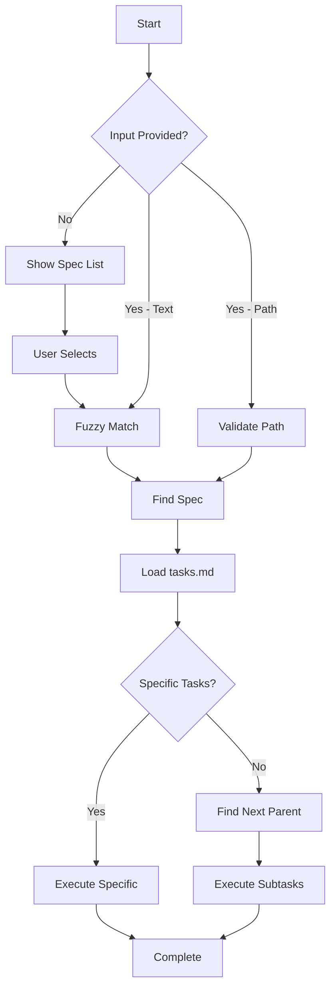

# Execute Tasks Master v6 - Usage Examples

## Interactive Spec Selection Flow

### Scenario 1: No Input Provided

```
User runs: execute-tasks-master
System responds:

📋 Which spec would you like to work on?

Available specs:
1. 2025-09-07-xml-security-remediation
2. 2025-09-07-fix-skipped-tests
3. 2025-09-05-autopilot-engine
4. 2025-01-05-quality-checker-uplift

You can enter:
- A number (1-4) to select from the list
- A partial name like "quality checker"
- A full path

User enters: quality checker
System: Matches to 2025-01-05-quality-checker-uplift
System: Finds next uncompleted parent task (Task 2: Fix Blocking Behavior Tests)
System: Executes tasks 2.2, 2.3, 2.4, 2.5, 2.6
```

### Scenario 2: Fuzzy Match Input

```
User runs: execute-tasks-master "autopilot"
System: Fuzzy matches to 2025-09-05-autopilot-engine
System: Reads tasks.md, finds next uncompleted parent task
System: Executes those tasks
```

### Scenario 3: Full Path with Specific Tasks

```
User runs: execute-tasks-master ".agent-os/specs/2025-01-05-quality-checker-uplift" ["2.2", "2.3"]
System: Uses exact path
System: Executes only tasks 2.2 and 2.3
```

## Task Selection Logic

### Finding Next Uncompleted Parent Task

Given this task structure:

```markdown
- [x] 1. Fix TypeScript Strict Mode Tests
  - [x] 1.1 Enable and analyze TypeScript strict null checks
  - [x] 1.2 Update TypeScript engine
  - [x] 1.3 Enable and analyze TypeScript no implicit any
  - [x] 1.4 Update TypeScript engine
  - [x] 1.5 Remove skip modifiers
  - [x] 1.6 Verify all TypeScript strict mode tests pass

- [ ] 2. Fix Blocking Behavior Tests <-- SELECTED (first incomplete parent)
  - [x] 2.1 Enable blocking behavior describe block
  - [ ] 2.2 Analyze type safety blocking <-- EXECUTE
  - [ ] 2.3 Update autopilot adapter <-- EXECUTE
  - [ ] 2.4 Analyze complexity blocking <-- EXECUTE
  - [ ] 2.5 Update autopilot adapter <-- EXECUTE
  - [ ] 2.6 Verify all blocking tests <-- EXECUTE

- [ ] 3. Fix Failing Unit Tests
  - [ ] 3.1 Analyze quality-checker.unit.test.ts
  - [ ] 3.2 Update error message expectations
```

The system will:

1. Skip Task 1 (all subtasks complete)
2. Select Task 2 (has incomplete subtasks)
3. Execute tasks 2.2 through 2.6
4. Not proceed to Task 3 unless explicitly requested

## Fuzzy Matching Algorithm

The fuzzy matching uses these strategies:

1. **Exact Substring Match** (Score: 100)
   - Input: "quality checker"
   - Matches: "quality-checker-uplift" ✓

2. **All Words Present** (Score: 80)
   - Input: "autopilot engine"
   - Matches: "autopilot-engine" ✓

3. **Some Words Present** (Score: 50 per word)
   - Input: "security xml"
   - Matches: "xml-security-remediation" ✓

4. **Normalized Matching**
   - Spaces → dashes
   - Case insensitive
   - Special characters removed

## Error Handling

### No Match Found

```
User runs: execute-tasks-master "nonexistent spec"
System responds:

❌ No spec found matching "nonexistent spec"

Available specs:
- 2025-09-07-xml-security-remediation
- 2025-09-07-fix-skipped-tests
- 2025-09-05-autopilot-engine
- 2025-01-05-quality-checker-uplift

Please try again with a different search term.
```

### Invalid Path

```
User runs: execute-tasks-master "/invalid/path"
System responds:

❌ Path not found: /invalid/path
```

### All Tasks Complete

```
If all tasks in the selected spec are complete:
System: "All tasks in this spec are already complete. No work to do!"
```

## Execution Flow Summary



## Key Features

1. **Interactive Selection**: No more guessing spec names
2. **Fuzzy Matching**: Type "quality" to find "quality-checker-uplift"
3. **Smart Defaults**: Automatically finds next logical work
4. **Cognitive Processing**: No bash parsing for task selection
5. **Clear Feedback**: Shows what will be executed before starting
6. **Hierarchical Awareness**: Respects parent-child task relationships
