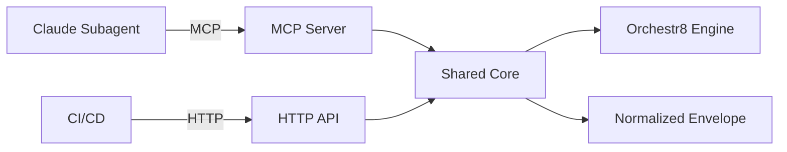

# Technical Specification

This is the technical specification for the spec detailed in @.agent-os/specs/2025-01-18-claude-subagents-integration/spec.md

> Created: 2025-01-18
> Version: 1.0.0

## Technical Requirements

### Core Integration Architecture

- **MCP Server Foundation**: Relies on @.agent-os/specs/2025-01-18-mcp-integration/ for tool definitions
- **HTTP API**: Express-based REST API mirroring MCP tool functionality
- **Normalized Envelope**: Uses @.agent-os/specs/2025-01-18-mcp-integration/sub-specs/normalized-envelope.md
- **Claude SDK Adapter**: Anthropic SDK integration with caching and JSON output
- **Correlation Tracking**: UUID-based correlation IDs across all operations
- **Cancellation Support**: AbortSignal propagation through execution chain
- **Prompt Caching**: Ephemeral cache for 90% cost reduction
- **JSON Output Mode**: Structured outputs with `response_format: { type: 'json_object' }`

### Performance Requirements

- **Orchestration Overhead**: <100ms for workflow initiation (p95)
- **Polling Interval**: Configurable 500ms-5000ms for status checks
- **Timeout Handling**: Graceful degradation with structured error responses
- **Memory Limits**: 10MB journal per execution, auto-truncation
- **Cache Hit Rate**: Target >80% for repeated workflows

### Security Requirements

- **Authentication**: Bearer token for HTTP, MCP tool permissions for local
- **Secret Handling**: Never log or return sensitive data
- **Input Validation**: Zod schemas for all inputs with strict validation
- **Rate Limiting**: Configurable limits per correlation ID
- **CORS**: Restrictive policy for HTTP endpoints

## Approach Options

### Option A: Separate Implementations

- Pros: Clean separation, easier testing, independent evolution
- Cons: Potential drift, duplicate code, maintenance overhead

### Option B: Shared Core with Adapters (Selected)

- Pros: Single source of truth, guaranteed parity, easier maintenance
- Cons: More complex initial architecture

### Option C: MCP-Only with HTTP Proxy

- Pros: Simplest implementation, automatic parity
- Cons: Requires MCP runtime for HTTP, potential latency

**Rationale:** Option B provides the best balance of maintainability and flexibility. The shared core ensures behavioral parity while thin adapters handle protocol-specific concerns.

## Architecture Design

### Package Structure

```
packages/
├── mcp-server/        # MCP server (see @.agent-os/specs/2025-01-18-mcp-integration/)
├── agent-adapters/
│   ├── claude/        # Claude SDK adapter
│   └── shared/        # Shared schemas and utilities
├── api/               # HTTP API implementation
└── testing/           # Parity test suite
```

### Component Interactions



### Data Flow

1. **Input Reception**: MCP tool call or HTTP request
2. **Validation**: Zod schema validation in shared core
3. **Execution**: Start workflow via orchestr8 engine
4. **Polling**: Status checks with correlation ID
5. **Response**: Normalized envelope with consistent structure

## Implementation Details

### MCP Server Integration

Claude subagents interact with the MCP server defined in @.agent-os/specs/2025-01-18-mcp-integration/

The MCP server provides three tools (`run_workflow`, `get_status`, `cancel_workflow`) that Claude agents access via the `mcp__orchestr8` tool namespace in Claude Code.

### HTTP API Implementation

The HTTP API provides REST endpoints that mirror MCP tool functionality:

```typescript
// packages/api/src/controller.ts
import { OrchestrationEngine } from '@orchestr8/core'
import {
  RunWorkflowSchema,
  GetStatusSchema,
  CancelWorkflowSchema,
} from '@orchestr8/mcp-server/schemas'
import type { NormalizedEnvelope } from '@orchestr8/mcp-server/envelope'

export class WorkflowController {
  private engine: OrchestrationEngine

  async runWorkflow(req: Request, res: Response): Promise<NormalizedEnvelope> {
    // Validate using same schemas as MCP
    const validated = RunWorkflowSchema.parse(req.body)

    // Execute via orchestr8 engine
    const execution = await this.engine.startExecution(
      validated.workflowId,
      validated.inputs,
      validated.options,
    )

    // Return normalized envelope (same as MCP)
    return {
      status: 'running',
      executionId: execution.id,
      workflowId: validated.workflowId,
      correlationId: validated.correlationId ?? `o8-${crypto.randomUUID()}`,
    }
  }
}
```

### JSON Output Mode

The integration MUST support structured JSON outputs using Anthropic's `response_format` configuration:

```typescript
// Enforce JSON-only outputs for structured responses
const response = await client.messages.create({
  model: "claude-opus-4-20250514",
  response_format: { type: "json_object" },
  // Optional: Add JSON schema for validation
  response_format: {
    type: "json_object",
    json_schema: workflowResultSchema
  },
  messages: [...]
})
```

**Trade-offs with Fine-grained Tool Streaming:**

- When using `fine-grained-tool-streaming-2025-05-14` beta, server-side JSON validation is disabled
- Client must handle `input_json_delta` assembly and validation
- Provides lower latency but requires robust client-side error handling

## Prompt Caching Strategy

### System Prompt Caching

```typescript
{
  system: [
    {
      type: 'text',
      text: 'Large system prompt...',
      cache_control: { type: 'ephemeral' },
    },
  ]
}
```

### Tool Definition Caching

```typescript
{
  tools: [
    { name: "run_workflow", ... },
    {
      name: "cancel_workflow",
      cache_control: { type: "ephemeral" } // Last tool gets cache
    }
  ]
}
```

### Cache Metrics Tracking

```typescript
// Map Anthropic usage fields to envelope metrics
interface CacheMetrics {
  cache_creation_input_tokens: number
  cache_read_input_tokens: number
  cache_hit_ratio: number // Calculated: cache_read / (cache_read + regular_input)
}

// Include in normalized envelope
envelope.cost = {
  inputTokens: usage.input_tokens,
  outputTokens: usage.output_tokens,
  cacheCreationTokens: usage.cache_creation_input_tokens,
  cacheReadTokens: usage.cache_read_input_tokens,
  totalCost: undefined, // Optional - requires pricing table maintenance
}
```

### Expected Savings

- **Token Cost**: 90% reduction on cached content
- **Response Time**: 30-50% improvement for cached prompts
- **Cache Lifetime**: Configurable TTL (5m or 1h with beta header)
- **Compatibility Note**: Older SDKs may require `anthropic-beta: prompt-caching-2024-07-31` header

## Thinking Block Handling

### Safety Requirements

- Thinking blocks MUST NOT be stored in execution journals or logs
- If thinking blocks appear in streaming, they should be ignored/redacted
- Only rationale-lite summaries should be included in responses

### Response Processing

```typescript
export function processAgentResponse(response: any) {
  // Filter out thinking blocks if present
  const filteredContent = response.content.filter(
    (block) => block.type !== 'thinking' && block.type !== 'redacted_thinking',
  )

  // Extract only safe content for envelope
  return {
    rationale: extractRationaleSummary(filteredContent),
    result: extractResult(filteredContent),
  }
}
```

### Streaming Modes

When using streaming with extended thinking or fine-grained tool streaming:

```typescript
// Fine-grained tool streaming configuration
const streamConfig = {
  headers: {
    'anthropic-beta': 'fine-grained-tool-streaming-2025-05-14',
  },
  // Client-side JSON validation required
  validatePartialJson: true,
  assembleInputDeltas: true,
}

// Handle partial JSON assembly
function assembleToolInput(deltas: Array<{ partial_json: string }>) {
  let accumulated = ''
  for (const delta of deltas) {
    accumulated += delta.partial_json
  }
  // Validate and repair JSON if needed
  return validateAndRepairJson(accumulated)
}
```

## External Dependencies

- **@anthropic-ai/sdk** - Claude API client
  - Justification: Official SDK for Claude integration
  - Version: Latest stable with prompt caching support

- **zod** - Schema validation (already in project)
  - Justification: Type-safe validation across surfaces
  - Version: 3.25+

- **express** - HTTP API framework (already planned)
  - Justification: Consistent with roadmap
  - Version: 4.18+

**MCP Dependencies:** See @.agent-os/specs/2025-01-18-mcp-integration/sub-specs/technical-spec.md

## Migration Path

### Phase 1: MCP Server (Week 1)

- Basic MCP server with three actions
- Shared validation schemas
- Initial parity tests

### Phase 2: HTTP API (Week 1)

- Mirror endpoints
- Shared core extraction
- Complete parity suite

### Phase 3: Optimization (Week 2)

- Prompt caching implementation
- Chain of Thought support
- Performance tuning

### Phase 4: Agent Templates (Week 2)

- Claude subagent configurations
- Example workflows
- Documentation
