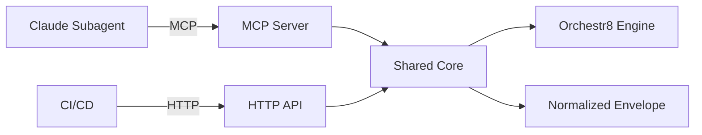

# Technical Specification

This is the technical specification for the spec detailed in @.agent-os/specs/2025-01-18-claude-subagents-integration/spec.md

> Created: 2025-01-18
> Version: 1.0.0

## Technical Requirements

### Core Integration Architecture

- **MCP Server Foundation**: Relies on @.agent-os/specs/2025-01-18-mcp-integration/ for tool definitions
- **HTTP API**: Express-based REST API mirroring MCP tool functionality
- **Normalized Envelope**: Uses @.agent-os/specs/2025-01-18-mcp-integration/sub-specs/normalized-envelope.md
- **Claude SDK Adapter**: Anthropic SDK integration with caching and JSON output
- **Correlation Tracking**: UUID-based correlation IDs across all operations
- **Cancellation Support**: AbortSignal propagation through execution chain
- **Prompt Caching**: Ephemeral cache for 90% cost reduction
- **JSON Output Mode**: Structured outputs with `response_format: { type: 'json_object' }`

### Performance Requirements

- **Orchestration Overhead**: <100ms for workflow initiation (p95)
- **Polling Interval**: Configurable 500ms-5000ms for status checks
- **Timeout Handling**: Graceful degradation with structured error responses
- **Memory Limits**: 10MB journal per execution, auto-truncation
- **Cache Hit Rate**: Target >80% for repeated workflows

### Security Requirements

- **Authentication**: Bearer token for HTTP, MCP tool permissions for local
- **Secret Handling**: Never log or return sensitive data
- **Input Validation**: Zod schemas for all inputs with strict validation
- **Rate Limiting**: Configurable limits per correlation ID
- **CORS**: Restrictive policy for HTTP endpoints

## Approach Options

### Option A: Separate Implementations

- Pros: Clean separation, easier testing, independent evolution
- Cons: Potential drift, duplicate code, maintenance overhead

### Option B: Shared Core with Adapters (Selected)

- Pros: Single source of truth, guaranteed parity, easier maintenance
- Cons: More complex initial architecture

### Option C: MCP-Only with HTTP Proxy

- Pros: Simplest implementation, automatic parity
- Cons: Requires MCP runtime for HTTP, potential latency

**Rationale:** Option B provides the best balance of maintainability and flexibility. The shared core ensures behavioral parity while thin adapters handle protocol-specific concerns.

## Architecture Design

### Package Structure

```text
packages/
├── mcp-server/        # MCP server (see @.agent-os/specs/2025-01-18-mcp-integration/)
├── agent-adapters/
│   ├── claude/        # Claude SDK adapter
│   └── shared/        # Shared schemas and utilities
├── api/               # HTTP API implementation
└── testing/           # Parity test suite
```

### Task Tool Pattern

The Claude Task tool enables subagent delegation with structured task execution:

```typescript
// Task tool interface for subagent delegation
interface TaskTool {
  name: 'Task'
  description: string // 3-5 word task description
  prompt: string // Detailed task for the agent
  subagent_type: string // Specific agent type to invoke
}

// Example usage in Claude subagent
const taskResult = await executeTask({
  description: 'Run workflow validation',
  prompt:
    'Validate the data processing workflow against schema and execute with retry logic',
  subagent_type: 'orchestr8-executor',
})
```

### Agent Loop Implementation

Implement a robust agent loop pattern with comprehensive safeguards:

```typescript
// packages/agent-adapters/claude/agent-loop.ts
export interface AgentLoopOptions {
  maxIterations?: number // Default: 10, max: 15
  timeout?: number // Default: 30000ms
  toolChoice?: ToolChoice // Tool selection strategy
  onIteration?: (n: number) => void // Progress callback
  abortSignal?: AbortSignal // Cancellation support
}

export async function runAgentLoop(
  client: Anthropic,
  initialPrompt: string,
  tools: Tool[],
  options: AgentLoopOptions = {},
) {
  const messages: Message[] = [{ role: 'user', content: initialPrompt }]

  const maxIterations = Math.min(options.maxIterations ?? 10, 15)
  const timeout = options.timeout ?? 30000
  const startTime = Date.now()

  let iterations = 0

  while (iterations < maxIterations) {
    // Check timeout
    if (Date.now() - startTime > timeout) {
      throw new Error(`Agent loop timeout after ${timeout}ms`)
    }

    // Check abort signal
    if (options.abortSignal?.aborted) {
      throw new Error('Agent loop aborted by user')
    }

    iterations++
    options.onIteration?.(iterations)

    // Determine tool choice strategy
    const toolChoice = determineToolChoice({
      iteration: iterations,
      messages,
      defaultChoice: options.toolChoice,
    })

    const response = await client.messages.create({
      model: 'claude-opus-4-20250514',
      messages,
      tools,
      tool_choice: toolChoice,
      max_tokens: 4096,
    })

    // Handle pause_turn for continuation
    if (response.stop_reason === 'pause_turn') {
      messages.push({ role: 'assistant', content: response.content })
      // Continue with preserved state
      continue
    }

    // Add Claude's response to history
    messages.push({ role: 'assistant', content: response.content })

    // Check if Claude requested tool use
    if (response.stop_reason === 'tool_use') {
      const toolResults = await executeToolsInParallel(response.content)

      // Group all tool results in single user message
      if (toolResults.length > 0) {
        messages.push({ role: 'user', content: toolResults })
      }
    } else {
      // No more tool use, task complete
      return {
        final_response: response,
        iterations,
        messages,
        duration_ms: Date.now() - startTime,
      }
    }
  }

  throw new Error(`Agent loop exceeded maximum iterations (${maxIterations})`)
}

// Execute tools in parallel for better performance
async function executeToolsInParallel(
  content: ContentBlock[],
): Promise<ToolResult[]> {
  const toolPromises = content
    .filter((block) => block.type === 'tool_use')
    .map(async (block) => {
      try {
        const result = await executeOrchestr8Tool(block.name, block.input)
        return {
          type: 'tool_result',
          tool_use_id: block.id,
          content: JSON.stringify(result),
        }
      } catch (error) {
        return {
          type: 'tool_result',
          tool_use_id: block.id,
          content: error.message,
          is_error: true,
        }
      }
    })

  return Promise.all(toolPromises)
}
```

### Component Interactions



### Data Flow

1. **Input Reception**: MCP tool call or HTTP request
2. **Validation**: Zod schema validation in shared core
3. **Execution**: Start workflow via orchestr8 engine
4. **Polling**: Status checks with correlation ID
5. **Response**: Normalized envelope with consistent structure

## Implementation Details

### MCP Server Integration

Claude subagents interact with the MCP server defined in @.agent-os/specs/2025-01-18-mcp-integration/

The MCP server provides three tools (`run_workflow`, `get_status`, `cancel_workflow`) that Claude agents access by their short names in Claude Code.

### MCP Server Configuration

Define the orchestr8 MCP server configuration for Claude Code integration:

```json
// .mcp.json or mcp-config.json
{
  "mcpServers": {
    "orchestr8": {
      "command": "node",
      "args": ["./packages/mcp-server/dist/index.js"],
      "env": {
        "PORT": "8088",
        "NODE_ENV": "production",
        "ORCHESTR8_ENGINE_PATH": "./packages/core"
      }
    },
    "orchestr8-dev": {
      "command": "pnpm",
      "args": ["--filter", "@orchestr8/mcp-server", "dev"],
      "env": {
        "PORT": "8088",
        "NODE_ENV": "development"
      }
    }
  }
}
```

### Tool Choice Strategy

Implement comprehensive tool choice modes for different execution patterns:

```typescript
// packages/agent-adapters/claude/tool-choice.ts
export enum ToolChoiceMode {
  AUTO = 'auto', // Claude decides whether to use tools (default)
  ANY = 'any', // Claude must use one of the provided tools
  NONE = 'none', // Prevent Claude from using any tools
  SPECIFIC = 'tool', // Force Claude to use a specific tool
}

export function determineToolChoice(context: ExecutionContext): ToolChoice {
  // Force specific tool for deterministic workflows
  if (context.requiresWorkflowExecution) {
    return {
      type: 'tool',
      name: 'run_workflow',
    }
  }

  // Force any tool when action is required
  if (context.actionRequired && !context.allowTextResponse) {
    return { type: 'any' }
  }

  // Prevent tool use for information queries
  if (context.queryType === 'information_only') {
    return { type: 'none' }
  }

  // Default: Let Claude decide
  return { type: 'auto' }
}
```

### Enhanced Error Handling

Implement Claude-specific error handling with retry patterns:

```typescript
// packages/agent-adapters/claude/error-handling.ts
export interface ClaudeToolError {
  type: 'tool_result'
  tool_use_id: string
  content: string
  is_error: true
}

export class ErrorHandler {
  private retryCount = new Map<string, number>()
  private readonly maxRetries = 2

  formatToolError(
    toolUseId: string,
    error: Error,
    context?: Record<string, unknown>,
  ): ClaudeToolError {
    const count = this.retryCount.get(toolUseId) ?? 0
    this.retryCount.set(toolUseId, count + 1)

    // Determine if error is retryable
    const isRetryable = this.isRetryableError(error)
    const shouldRetry = isRetryable && count < this.maxRetries

    // Format error message for Claude
    let errorMessage = error.message

    if (error.name === 'ValidationError') {
      errorMessage = `Error: Missing required parameter(s): ${error.details}`
    } else if (error.name === 'TimeoutError') {
      errorMessage = `Error: Operation timed out after ${error.timeout}ms`
    } else if (error.name === 'CircuitBreakerError') {
      errorMessage = `Error: Service temporarily unavailable (circuit breaker open)`
    }

    // Add retry hint for Claude
    if (shouldRetry) {
      errorMessage += ` (Retry ${count + 1}/${this.maxRetries})`
    }

    return {
      type: 'tool_result',
      tool_use_id: toolUseId,
      content: errorMessage,
      is_error: true,
    }
  }

  private isRetryableError(error: Error): boolean {
    const retryableErrors = [
      'TimeoutError',
      'NetworkError',
      'ServiceUnavailableError',
      'RateLimitError',
    ]

    return (
      retryableErrors.includes(error.name) ||
      error.code === 'ECONNRESET' ||
      error.code === 'ETIMEDOUT'
    )
  }
}
```

### HTTP API Implementation

The HTTP API provides REST endpoints that mirror MCP tool functionality:

```typescript
// packages/api/src/controller.ts
import { OrchestrationEngine } from '@orchestr8/core'
import {
  RunWorkflowSchema,
  GetStatusSchema,
  CancelWorkflowSchema,
} from '@orchestr8/mcp-server/schemas'
import type { NormalizedEnvelope } from '@orchestr8/mcp-server/envelope'

export class WorkflowController {
  private engine: OrchestrationEngine

  async runWorkflow(req: Request, res: Response): Promise<NormalizedEnvelope> {
    // Validate using same schemas as MCP
    const validated = RunWorkflowSchema.parse(req.body)

    // Execute via orchestr8 engine
    const execution = await this.engine.startExecution(
      validated.workflowId,
      validated.inputs,
      validated.options,
    )

    // Return normalized envelope (same as MCP)
    return {
      status: 'running',
      executionId: execution.id,
      workflowId: validated.workflowId,
      correlationId: validated.correlationId ?? `o8-${crypto.randomUUID()}`,
    }
  }
}
```

### JSON Output Mode

The integration MUST support structured JSON outputs using Anthropic's `response_format` configuration:

```typescript
// Enforce JSON-only outputs for structured responses
const response = await client.messages.create({
  model: "claude-opus-4-20250514",
  response_format: { type: "json_object" },
  // Optional: Add JSON schema for validation
  response_format: {
    type: "json_object",
    json_schema: workflowResultSchema
  },
  messages: [...]
})
```

**Trade-offs with Fine-grained Tool Streaming:**

- When using `fine-grained-tool-streaming-2025-05-14` beta, server-side JSON validation is disabled
- Client must handle `input_json_delta` assembly and validation
- Provides lower latency but requires robust client-side error handling

## Prompt Caching Strategy

### Cache Management Requirements

- **Minimum Cache Size**: 1024 characters required for cache breakpoint
- **Cache Placement**: Apply to last tool definition or end of system prompt
- **TTL Configuration**: 5 minutes default, 1 hour with beta header
- **Beta Header**: `anthropic-beta: prompt-caching-2024-07-31` for older SDKs

### System Prompt Caching

```typescript
// Ensure prompt is >1024 characters for effective caching
const systemPrompt = {
  system: [
    {
      type: 'text',
      text: 'Large system prompt with orchestr8 context...',
      cache_control: { type: 'ephemeral' },
    },
  ],
}

// Verify cache eligibility
if (systemPrompt.system[0].text.length < 1024) {
  console.warn('System prompt too short for caching (<1024 chars)')
}
```

### Tool Definition Caching

```typescript
// Apply cache to the last tool for optimal placement
const tools = [
  { name: "run_workflow", description: "...", input_schema: {...} },
  { name: "get_status", description: "...", input_schema: {...} },
  {
    name: "cancel_workflow",
    description: "...",
    input_schema: {...},
    cache_control: { type: "ephemeral" } // Last tool gets cache
  }
]
```

### Cache Metrics Tracking

```typescript
// Enhanced cache metrics with comprehensive analytics
export interface CacheMetrics {
  cache_creation_input_tokens: number
  cache_read_input_tokens: number
  regular_input_tokens: number
  cache_hit_ratio: number
  estimated_savings: number
  break_even_point: number
  optimization_score: number
}

export class CacheMetricsTracker {
  private metrics: Map<string, CacheMetrics> = new Map()
  private historicalHitRates: number[] = []

  recordUsage(correlationId: string, usage: AnthropicUsage): void {
    const cacheReadTokens = usage.cache_read_input_tokens ?? 0
    const regularInputTokens = usage.input_tokens - cacheReadTokens
    const cacheCreationTokens = usage.cache_creation_input_tokens ?? 0

    const hitRatio = this.calculateHitRatio(cacheReadTokens, regularInputTokens)
    this.historicalHitRates.push(hitRatio)

    const metrics: CacheMetrics = {
      cache_creation_input_tokens: cacheCreationTokens,
      cache_read_input_tokens: cacheReadTokens,
      regular_input_tokens: regularInputTokens,
      cache_hit_ratio: hitRatio,
      estimated_savings: this.calculateSavings(
        cacheReadTokens,
        cacheCreationTokens,
      ),
      break_even_point: this.calculateBreakEvenPoint(cacheCreationTokens),
      optimization_score: this.calculateOptimizationScore(hitRatio),
    }

    this.metrics.set(correlationId, metrics)
  }

  private calculateHitRatio(cacheRead: number, regular: number): number {
    const total = cacheRead + regular
    return total > 0 ? cacheRead / total : 0
  }

  private calculateSavings(
    cacheReadTokens: number,
    cacheCreationTokens: number,
  ): number {
    // 90% cost reduction on cached tokens, 25% surcharge on creation
    const regularCostPerToken = 0.00001
    const cachedCostPerToken = 0.000001 // 90% reduction
    const creationCostPerToken = 0.0000125 // 25% surcharge

    const savingsFromCache =
      cacheReadTokens * (regularCostPerToken - cachedCostPerToken)
    const creationCost =
      cacheCreationTokens * (creationCostPerToken - regularCostPerToken)

    return savingsFromCache - creationCost
  }

  private calculateBreakEvenPoint(cacheCreationTokens: number): number {
    // Calculate how many cache reads needed to break even on creation cost
    if (cacheCreationTokens === 0) return 0

    const creationSurcharge = 0.25 // 25% extra cost
    const cacheDiscount = 0.9 // 90% discount

    // Break even = creation_surcharge / cache_discount
    return Math.ceil((cacheCreationTokens * creationSurcharge) / cacheDiscount)
  }

  private calculateOptimizationScore(currentHitRatio: number): number {
    // Score 0-100 based on hit ratio and trend
    const targetHitRatio = 0.8 // 80% target
    const ratioScore = Math.min(currentHitRatio / targetHitRatio, 1) * 70

    // Add trend score (30% weight)
    const recentRates = this.historicalHitRates.slice(-10)
    const avgRate = recentRates.reduce((a, b) => a + b, 0) / recentRates.length
    const trendScore = currentHitRatio > avgRate ? 30 : 15

    return Math.round(ratioScore + trendScore)
  }

  getMetrics(correlationId: string): CacheMetrics | undefined {
    return this.metrics.get(correlationId)
  }

  getAggregateMetrics(): {
    avgHitRatio: number
    totalSavings: number
    optimizationScore: number
  } {
    const allMetrics = Array.from(this.metrics.values())

    return {
      avgHitRatio:
        allMetrics.reduce((sum, m) => sum + m.cache_hit_ratio, 0) /
        allMetrics.length,
      totalSavings: allMetrics.reduce((sum, m) => sum + m.estimated_savings, 0),
      optimizationScore:
        allMetrics.reduce((sum, m) => sum + m.optimization_score, 0) /
        allMetrics.length,
    }
  }
}

// Include enhanced metrics in normalized envelope
envelope.cost = {
  inputTokens: usage.input_tokens,
  outputTokens: usage.output_tokens,
  cacheCreationTokens: usage.cache_creation_input_tokens,
  cacheReadTokens: usage.cache_read_input_tokens,
  cacheHitRatio: metrics.cache_hit_ratio,
  estimatedSavings: metrics.estimated_savings,
  breakEvenPoint: metrics.break_even_point,
  optimizationScore: metrics.optimization_score,
  totalCost: calculateTotalCost(usage), // With pricing table
}
```

### Cache Optimization Strategies

```typescript
// Intelligent cache placement based on content size
export class CacheOptimizer {
  optimizeForCaching(content: {
    system?: string
    tools?: Tool[]
    context?: string[]
  }): CachedContent {
    const result: CachedContent = {}

    // Prioritize caching order based on size and reuse potential
    const candidates = [
      { key: 'system', value: content.system, minSize: 1024 },
      { key: 'tools', value: JSON.stringify(content.tools), minSize: 1024 },
      { key: 'context', value: content.context?.join(''), minSize: 2048 },
    ]

    // Apply cache to largest eligible content
    const eligible = candidates
      .filter((c) => c.value && c.value.length >= c.minSize)
      .sort((a, b) => b.value.length - a.value.length)

    if (eligible.length > 0) {
      const target = eligible[0]
      result[target.key] = {
        content: target.value,
        cache_control: { type: 'ephemeral' },
      }
    }

    return result
  }
}
```

### Expected Savings

- **Token Cost**: 90% reduction on cached content (>1024 chars)
- **Response Time**: 30-50% improvement for cached prompts
- **Cache Lifetime**: 5 minutes (default) or 1 hour (with beta header)
- **Hit Rate Target**: >80% for repeated workflows
- **Break-even Point**: 2-3 requests to amortize cache creation cost

## Thinking Block Handling

### Safety Requirements

- Thinking blocks MUST NOT be stored in execution journals or logs
- If thinking blocks appear in streaming, they should be ignored/redacted
- Only rationale-lite summaries should be included in responses

### Response Processing

```typescript
export function processAgentResponse(response: any) {
  // Filter out thinking blocks if present
  const filteredContent = response.content.filter(
    (block) => block.type !== 'thinking' && block.type !== 'redacted_thinking',
  )

  // Extract only safe content for envelope
  return {
    rationale: extractRationaleSummary(filteredContent),
    result: extractResult(filteredContent),
  }
}
```

### Streaming Modes

When using streaming with extended thinking or fine-grained tool streaming:

```typescript
// Fine-grained tool streaming configuration
const streamConfig = {
  headers: {
    'anthropic-beta': 'fine-grained-tool-streaming-2025-05-14',
  },
  // Client-side JSON validation required
  validatePartialJson: true,
  assembleInputDeltas: true,
}

// Enhanced partial JSON assembly with error recovery
export class StreamingJsonAssembler {
  private accumulated = ''
  private bracketStack: string[] = []

  addDelta(delta: { partial_json: string }): void {
    this.accumulated += delta.partial_json
    this.updateBracketStack(delta.partial_json)
  }

  private updateBracketStack(text: string): void {
    for (const char of text) {
      if (char === '{' || char === '[') {
        this.bracketStack.push(char)
      } else if (char === '}' || char === ']') {
        this.bracketStack.pop()
      }
    }
  }

  isComplete(): boolean {
    return this.bracketStack.length === 0
  }

  getJson(): unknown {
    if (!this.isComplete()) {
      // Attempt to repair incomplete JSON
      return this.repairJson(this.accumulated)
    }

    try {
      return JSON.parse(this.accumulated)
    } catch (error) {
      // Fallback to repair if parsing fails
      return this.repairJson(this.accumulated)
    }
  }

  private repairJson(partial: string): unknown {
    // Add missing closing brackets based on stack
    let repaired = partial
    const closingBrackets = this.bracketStack
      .reverse()
      .map((b) => (b === '{' ? '}' : ']'))
      .join('')

    repaired += closingBrackets

    try {
      return JSON.parse(repaired)
    } catch {
      // Return partial data if repair fails
      return { partial: true, data: partial }
    }
  }
}

// WebSocket/SSE integration for real-time streaming
export class StreamingAdapter {
  constructor(
    private ws?: WebSocket,
    private sse?: EventSource,
  ) {}

  async streamToolExecution(
    toolCall: ToolCall,
    onProgress: (event: ProgressEvent) => void,
  ): Promise<void> {
    const assembler = new StreamingJsonAssembler()

    // Set up streaming based on transport
    if (this.ws) {
      this.ws.onmessage = (event) => {
        const delta = JSON.parse(event.data)
        if (delta.type === 'input_json_delta') {
          assembler.addDelta(delta)
          onProgress({
            type: 'partial',
            data: assembler.getJson(),
            complete: assembler.isComplete(),
          })
        }
      }
    } else if (this.sse) {
      this.sse.onmessage = (event) => {
        const delta = JSON.parse(event.data)
        if (delta.type === 'input_json_delta') {
          assembler.addDelta(delta)
          onProgress({
            type: 'partial',
            data: assembler.getJson(),
            complete: assembler.isComplete(),
          })
        }
      }
    }
  }
}
```

## External Dependencies

- **@anthropic-ai/sdk** - Claude API client
  - Justification: Official SDK for Claude integration
  - Version: Latest stable with prompt caching support

- **zod** - Schema validation (already in project)
  - Justification: Type-safe validation across surfaces
  - Version: 3.25+

- **express** - HTTP API framework (already planned)
  - Justification: Consistent with roadmap
  - Version: 4.18+

**MCP Dependencies:** See @.agent-os/specs/2025-01-18-mcp-integration/sub-specs/technical-spec.md

## Migration Path

### Phase 1: MCP Server (Week 1)

- Basic MCP server with three actions
- Shared validation schemas
- Initial parity tests

### Phase 2: HTTP API (Week 1)

- Mirror endpoints
- Shared core extraction
- Complete parity suite

### Phase 3: Optimization (Week 2)

- Prompt caching implementation
- Chain of Thought support
- Performance tuning

### Phase 4: Agent Templates (Week 2)

- Claude subagent configurations
- Example workflows
- Documentation
