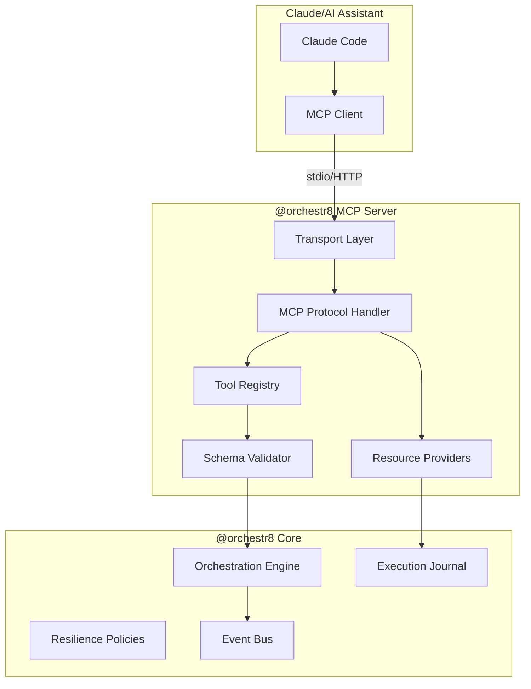

# Technical Specification

MCP server implementation for @orchestr8 workflow orchestration.

> Created: 2025-01-18
> Version: 1.0.0

## Architecture Overview



## MCP Server Implementation

### Server Configuration

```typescript
// packages/mcp-server/src/server.ts
import { Server } from '@modelcontextprotocol/sdk/server/index.js'
import { StdioServerTransport } from '@modelcontextprotocol/sdk/server/stdio.js'
import { z } from 'zod'
import { OrchestrationEngine } from '@orchestr8/core'

export class Orchestr8MCPServer {
  private server: Server
  private engine: OrchestrationEngine
  private correlations: Map<string, Set<string>>

  constructor(options: {
    name?: string
    version?: string
    engine: OrchestrationEngine
  }) {
    this.engine = options.engine
    this.correlations = new Map()

    this.server = new Server(
      {
        name: options.name ?? '@orchestr8 MCP Server',
        version: options.version ?? '1.0.0',
      },
      {
        capabilities: {
          tools: {
            listChanged: true, // Support dynamic tool updates
          },
          resources: {
            subscribe: true, // Support resource subscriptions
          },
          logging: {}, // Enable structured logging
          experimental: {}, // Reserved for future features
        },
      },
    )

    this.registerTools()
    this.registerResources()
  }

  async start() {
    const transport = new StdioServerTransport()
    await this.server.connect(transport)
  }
}
```

## Tool Definitions

### Tool Naming Convention

When accessed through MCP clients, tools appear with their short names:

- `run_workflow`
- `get_status`
- `cancel_workflow`

### run_workflow Tool

```typescript
private registerRunWorkflow() {
  this.server.setRequestHandler(
    ToolsCallRequestSchema,
    async (request) => {
  if (request.params.name === 'run_workflow') {
        const input = RunWorkflowSchema.parse(request.params.arguments)

        // Generate correlation ID if not provided
        const correlationId = input.correlationId ?? `o8-${crypto.randomUUID()}`

        // Start workflow execution
        const execution = await this.engine.startExecution(
          input.workflowId,
          input.inputs,
          {
            correlationId,
            timeout: input.options?.timeoutMs,
            concurrency: input.options?.concurrency,
            resilience: input.options?.resilience
          }
        )

        // Track correlation
        this.trackCorrelation(correlationId, execution.id)

        // Handle long-polling if requested
        if (input.waitForMs && input.waitForMs > 0) {
          const result = await this.pollExecution(
            execution.id,
            input.waitForMs
          )
          return this.toToolResult(result, correlationId)
        }

        // Return immediate status
  return this.toToolResult({
          status: 'running',
          executionId: execution.id,
          workflowId: input.workflowId,
          correlationId
        }, correlationId)
      }
    }
  )
}
```

### get_status Tool

```typescript
private registerGetStatus() {
  this.server.setRequestHandler(
    ToolsCallRequestSchema,
    async (request) => {
  if (request.params.name === 'get_status') {
        const input = GetStatusSchema.parse(request.params.arguments)

        // Get execution status
        const status = await this.engine.getExecutionStatus(
          input.executionId
        )

        // Handle long-polling
        if (input.waitForMs && input.waitForMs > 0 && status.state === 'running') {
          const result = await this.pollExecution(
            input.executionId,
            input.waitForMs
          )
          return this.toToolResult(result, input.correlationId)
        }

        return this.toToolResult({
          status: this.mapExecutionState(status.state),
          executionId: input.executionId,
          workflowId: status.workflowId,
          data: status.output,
          logs: status.logs,
          error: status.error ? this.formatError(status.error) : undefined,
          correlationId: input.correlationId
        }, input.correlationId)
      }
    }
  )
}
```

### cancel_workflow Tool

```typescript
private registerCancelWorkflow() {
  this.server.setRequestHandler(
    ToolsCallRequestSchema,
    async (request) => {
  if (request.params.name === 'cancel_workflow') {
        const input = CancelWorkflowSchema.parse(request.params.arguments)

        try {
          await this.engine.cancelExecution(
            input.executionId,
            input.reason
          )

          return this.toToolResult({
            status: 'ok',
            executionId: input.executionId,
            message: 'Workflow cancelled successfully',
            correlationId: input.correlationId
          }, input.correlationId)
        } catch (error) {
          return this.toToolResult({
            status: 'error',
            executionId: input.executionId,
            error: this.formatError(error),
            correlationId: input.correlationId
          }, input.correlationId)
        }
      }
    }
  )
}
```

## Resource Providers

### Workflow Definition Resource

```typescript
private registerWorkflowResource() {
  this.server.setRequestHandler(
    ResourcesReadRequestSchema,
    async (request) => {
      const uri = request.params.uri

      if (uri.startsWith('workflow://')) {
        const workflowId = uri.replace('workflow://', '')
        const workflow = await this.engine.getWorkflow(workflowId)

        return {
          contents: [{
            uri,
            mimeType: 'application/json',
            text: JSON.stringify(workflow, null, 2)
          }]
        }
      }
    }
  )
}
```

### Execution Journal Resource

```typescript
private registerExecutionResource() {
  this.server.setRequestHandler(
    ResourcesReadRequestSchema,
    async (request) => {
      const uri = request.params.uri

      if (uri.startsWith('execution://')) {
        const executionId = uri.replace('execution://', '')
        const journal = await this.engine.getExecutionJournal(executionId)

        return {
          contents: [{
            uri,
            mimeType: 'application/json',
            text: JSON.stringify(journal, null, 2)
          }]
        }
      }
    }
  )
}
```

## Schema Validation

### Input Schemas with Zod

```typescript
// packages/mcp-server/src/schemas.ts
import { z } from 'zod'

export const RunWorkflowSchema = z.object({
  workflowId: z.string().min(1).max(256),
  inputs: z.record(z.unknown()).default({}),
  options: z
    .object({
      timeoutMs: z.number().int().min(0).max(300000).optional(),
      concurrency: z.number().int().min(1).max(100).optional(),
      resilience: z
        .object({
          retry: z
            .object({
              maxAttempts: z.number().int().min(1).max(10).optional(),
              delayMs: z.number().int().min(0).optional(),
              backoff: z.enum(['fixed', 'exponential', 'linear']).optional(),
            })
            .optional(),
          circuitBreaker: z
            .object({
              threshold: z.number().min(0).max(1).optional(),
              windowMs: z.number().int().min(1000).optional(),
            })
            .optional(),
          timeout: z
            .object({
              ms: z.number().int().min(100).max(300000).optional(),
            })
            .optional(),
        })
        .optional(),
    })
    .optional(),
  waitForMs: z.number().int().min(0).max(10000).optional(),
  correlationId: z.string().min(1).max(256).optional(),
})

export const GetStatusSchema = z.object({
  executionId: z.string().min(1).max(256),
  waitForMs: z.number().int().min(0).max(10000).optional(),
  correlationId: z.string().min(1).max(256).optional(),
})

export const CancelWorkflowSchema = z.object({
  executionId: z.string().min(1).max(256),
  reason: z.string().max(1024).optional(),
  correlationId: z.string().min(1).max(256).optional(),
})
```

### Normalized Result Envelope

The normalized result envelope is the canonical response format used across all integration surfaces.

**See**: @.agent-os/specs/2025-01-18-mcp-integration/sub-specs/normalized-envelope.md for complete schema definition

```typescript
// Import the shared envelope type
import type { NormalizedEnvelope } from '../schemas/normalized-envelope'

// All MCP tool responses must be wrapped in ToolResult content
// and mark isError when status is 'error'
import type { ToolResult } from '@modelcontextprotocol/sdk/types.js'

export function toToolResult(
  data: Partial<NormalizedEnvelope>,
  correlationId: string,
): ToolResult {
  const envelope: NormalizedEnvelope = {
    status: data.status ?? 'ok',
    correlationId,
    ...data,
  } as NormalizedEnvelope

  return {
    content: [
      {
        type: 'text',
        text: JSON.stringify(envelope),
      },
    ],
    isError: envelope.status === 'error' ? true : undefined,
  }
}
```

## Long-Polling Implementation

```typescript
private async pollExecution(
  executionId: string,
  waitForMs: number
): Promise<Partial<NormalizedEnvelope>> {
  const startTime = Date.now()
  let pollInterval = 100 // ms (bounded backoff)

  while (Date.now() - startTime < waitForMs) {
    const status = await this.engine.getExecutionStatus(executionId)

    if (status.state !== 'running') {
      return {
        status: this.mapExecutionState(status.state),
        executionId,
        workflowId: status.workflowId,
        data: status.output,
        logs: status.logs,
        error: status.error ? this.formatError(status.error) : undefined
      }
    }

  // Wait before next poll with bounded backoff up to 1000ms
  await new Promise(resolve => setTimeout(resolve, pollInterval))
  pollInterval = Math.min(Math.floor(pollInterval * 1.5), 1000)
  }

  // Timeout reached, return current status
  const status = await this.engine.getExecutionStatus(executionId)
  return {
    status: 'running',
    executionId,
    workflowId: status.workflowId,
    logs: status.logs
  }
}
```

## Transport Layer

### stdio Transport (Primary)

```typescript
// packages/mcp-server/src/transports/stdio.ts
import { StdioServerTransport } from '@modelcontextprotocol/sdk/server/stdio.js'

export async function createStdioTransport() {
  // Primary transport for local AI assistants (Claude Code, etc.)
  return new StdioServerTransport()
}
```

The stdio transport enables direct communication between the MCP server and AI assistants running locally. Do not write logs to stdout; use stderr or MCP notifications. Optional Streamable HTTP transport may be added for hosted scenarios.

## Notifications Support

### Tool List Changes

```typescript
// Notify when available tools change
private async notifyToolsChanged() {
  await this.server.notification({
    method: 'notifications/tools/list_changed'
  })
}
```

### Resource Updates

```typescript
// Notify when resource content changes
private async notifyResourceUpdated(uri: string) {
  await this.server.notification({
    method: 'notifications/resources/updated',
    params: { uri }
  })
}

// Notify when resource list changes
private async notifyResourcesListChanged() {
  await this.server.notification({
    method: 'notifications/resources/list_changed'
  })
}
```

### Logging Notifications

```typescript
// Send structured logs to client
private async sendLog(level: 'debug' | 'info' | 'warn' | 'error', message: string, data?: any) {
  await this.server.notification({
    method: 'notifications/message',
    params: {
      level,
      logger: 'orchestr8',
      message,
      data
    }
  })
}
```

## Error Handling

### JSON-RPC Error Codes

```typescript
export enum MCPErrorCode {
  // Standard JSON-RPC errors
  PARSE_ERROR = -32700,
  INVALID_REQUEST = -32600,
  METHOD_NOT_FOUND = -32601,
  INVALID_PARAMS = -32602,
  INTERNAL_ERROR = -32603,

  // Custom orchestr8 errors
  WORKFLOW_NOT_FOUND = -32000,
  EXECUTION_NOT_FOUND = -32001,
  VALIDATION_ERROR = -32002,
  TIMEOUT_ERROR = -32003,
  RESILIENCE_ERROR = -32004
}

private formatError(error: unknown): NormalizedEnvelope['error'] {
  if (error instanceof WorkflowNotFoundError) {
    return {
      code: 'WORKFLOW_NOT_FOUND',
      message: error.message,
      retryable: false
    }
  }

  if (error instanceof TimeoutError) {
    return {
      code: 'TIMEOUT',
      message: error.message,
      retryable: true
    }
  }

  // Default error
  return {
    code: 'INTERNAL_ERROR',
    message: error instanceof Error ? error.message : 'Unknown error',
    retryable: false
  }
}
```

## Security Considerations

- **Input Validation**: All inputs validated with Zod schemas
- **Resource Limits**: Max payload sizes, timeout limits, concurrency caps
- **Secret Redaction**: Automatic removal of sensitive data from logs
- **Local-Only by Default**: stdio transport binds locally only
- **Correlation Tracking**: Full audit trail via correlation IDs

## Performance Optimization

- **Connection Pooling**: Reuse engine connections
- **Result Caching**: Cache workflow definitions (1-hour TTL)
- **Efficient Polling**: Exponential backoff for long-polling
- **Memory Limits**: 10MB journal limit per execution
- **Timeout Enforcement**: Max 5 minutes per workflow execution
