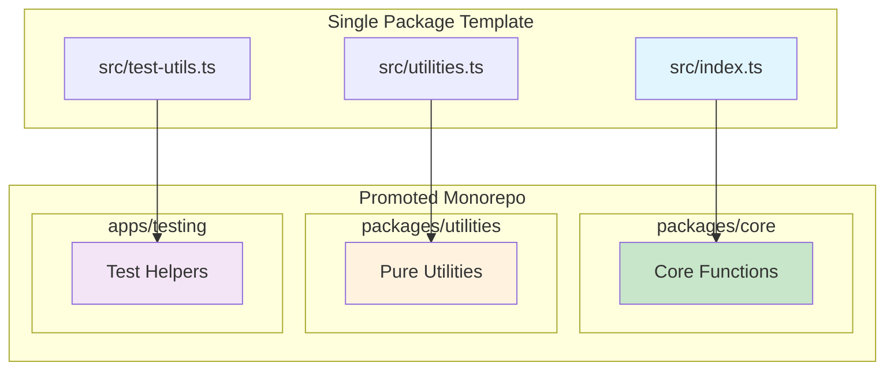
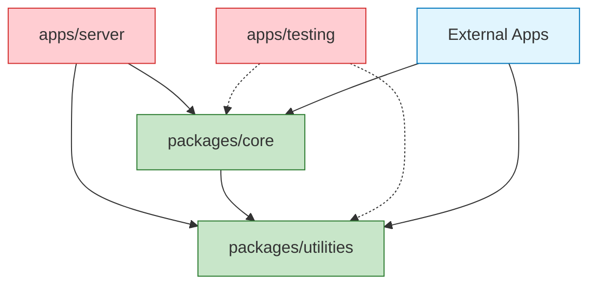
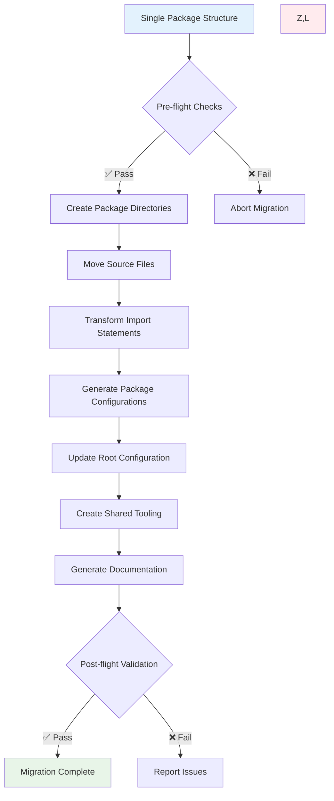
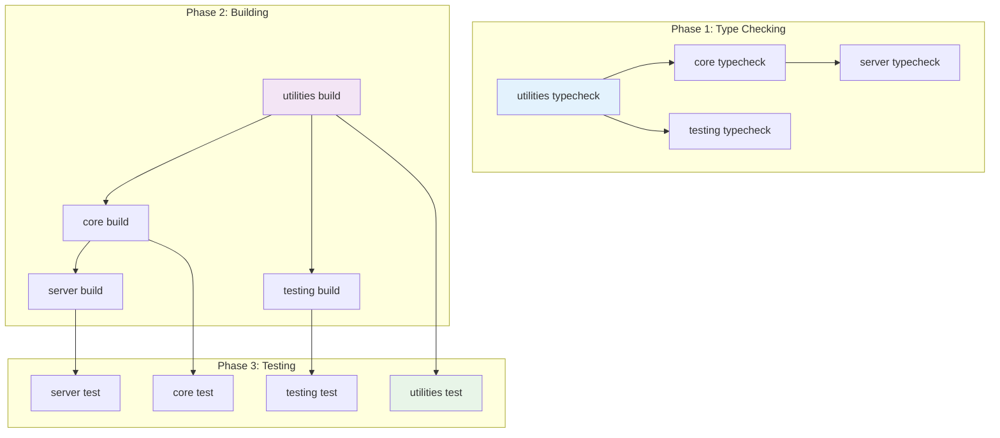

# Monorepo Architecture Guide

> **Comprehensive Technical Documentation for Bun Changesets Template Monorepo
> Structure**
>
> Version: 1.1.0  
> Last Updated: 2025-08-28  
> Status: Production Ready (incremental 2025 best-practice update)

This guide provides complete technical documentation for the monorepo package
structure design, including architecture patterns, migration procedures,
configuration details, and troubleshooting guidance.

## Table of Contents

- [Overview](#overview)
- [What's New in 1.1.0](#whats-new-in-110)
- [Architecture Design](#architecture-design)
- [Package Structure](#package-structure)
- [Configuration Reference](#configuration-reference)
- [Runtime & Version Policy](#runtime--version-policy)
- [Test Strategy (2025)](#test-strategy-2025)
- [Security & Supply Chain](#security--supply-chain)
- [Migration Guide](#migration-guide)
- [Implementation Examples](#implementation-examples)
- [Build & Caching Strategy](#build--caching-strategy)
- [Performance Guide](#performance-guide)
- [Observability & Governance](#observability--governance)
- [AI Agent Code Generation Rules](#ai-agent-code-generation-rules)
- [Troubleshooting](#troubleshooting)
- [Advanced Usage](#advanced-usage)

## Overview

The Bun Changesets Template monorepo structure enables seamless evolution from a
single-package template to a sophisticated multi-package workspace. This
architecture follows the "opt-in complexity" philosophy - start simple, add
structure when needed.

### Key Benefits

- **🚀 Performance**: Turborepo caching with >90% hit rates
- **🔧 Flexibility**: Clean package boundaries with zero circular dependencies
- **📦 Publishing**: Coordinated releases via Changesets
- **⚡ Speed**: Sub-50ms feedback loops maintained
- **🛡️ Security**: Enterprise-grade security across all packages

### Architecture Philosophy



## What's New in 1.1.0

| Area                 | Change                                                            | Rationale                  |
| -------------------- | ----------------------------------------------------------------- | -------------------------- |
| Test Strategy        | Dual-runner guidance (Vitest primary + optional Bun micro suites) | Use fastest tool per layer |
| Security             | SBOM, vulnerability scan, license & provenance steps              | Strengthen supply chain    |
| Remote Caching       | Remote cache setup & debugging tips                               | Faster CI loops            |
| Performance          | Measurable targets & methodology                                  | Repeatable validation      |
| Boundary Enforcement | Lint + graph validation patterns                                  | Prevent drift              |
| Runtime Policy       | Centralized version/upgrade cadence                               | Predictable maintenance    |
| Observability        | Timing, flake detection, coverage trends                          | Operational insight        |
| Publishing           | Deterministic hash + 2FA checklist                                | Release integrity          |
| Migration Script     | Dry-run + rollback guidance                                       | Safer automation           |
| Tasks API Pivot      | `pipeline` → `tasks`, `$TURBO_ROOT$` inputs                       | Modern Turborepo usage     |
| Hybrid TS References | Only publishable libs composite                                   | Faster iteration           |
| Boundaries Tool      | Graph validation (warn → enforce)                                 | Early drift detection      |
| Sidecars (Deferred)  | Placeholder for multi-service dev                                 | Avoid premature complexity |
| Prune Support        | Document `turbo prune` (Bun lock)                                 | Lean deploy artifacts      |

All additions are additive; no breaking structural changes.

## Architecture Design

### Package Boundaries

The monorepo structure defines four distinct package types, each with specific
responsibilities:

#### 🎯 `packages/core` - Template-Specific Functionality

**Purpose**: Contains functionality specific to this template  
**Publishable**: Yes  
**Dependencies**: Can use utilities, no external dependencies

```typescript
// packages/core/src/index.ts
export function hello(name: string = 'World'): string {
  return `Hello, ${name}!`
}

export async function startServer(): Promise<void> {
  // Template-specific server logic
}

export function shouldAutoStart(): boolean {
  // Template-specific startup logic
}
```

#### 🔧 `packages/utilities` - Pure Utility Functions

**Purpose**: Reusable utilities with zero external dependencies  
**Publishable**: Yes  
**Dependencies**: None (pure functions only)

```typescript
// packages/utilities/src/number-utils.ts
export function sum(a: number, b: number): number {
  return a + b
}

export function clamp(value: number, min: number, max: number): number {
  return Math.min(Math.max(value, min), max)
}

// packages/utilities/src/path-utils.ts
export function pathParts(path: string): string[] {
  return path.split('/').filter(Boolean)
}

export function joinPaths(...segments: string[]): string {
  return segments.join('/').replace(/\/+/g, '/')
}
```

#### 🧪 `apps/testing` - Testing Utilities

**Purpose**: Shared testing utilities across packages  
**Publishable**: No (private workspace package)  
**Dependencies**: Can use any testing libraries

```typescript
// apps/testing/src/test-utils.tsx
import { render, RenderOptions } from '@testing-library/react'
import { ReactElement } from 'react'

export function customRender(
  ui: ReactElement,
  options?: Omit<RenderOptions, 'wrapper'>
) {
  return render(ui, {
    wrapper: ({ children }) => <div>{children}</div>,
    ...options,
  })
}

export * from '@testing-library/react'
```

#### 🖥️ `apps/server` - Example Application (Optional)

**Purpose**: Demonstrates package usage in a real application  
**Publishable**: No (private application)  
**Dependencies**: Uses core + utilities + any app dependencies

```typescript
// apps/server/src/index.ts
import { hello } from '@bun-template/core'
import { sum } from '@bun-template/utilities'

const port = process.env.PORT || 3000

console.log(hello('Monorepo'))
console.log(`Math result: ${sum(2, 3)}`)

// Example server implementation
Bun.serve({
  port,
  fetch() {
    return new Response(hello('API'))
  },
})
```

### Dependency Graph



## Package Structure

### Complete File Structure

```
bun-changesets-template/
├── 📁 packages/                         # Publishable packages
│   ├── 📁 core/                        # Template-specific functionality
│   │   ├── 📁 src/
│   │   │   ├── 📄 index.ts            # Main exports (hello, startServer, etc.)
│   │   │   ├── 📄 index.test.ts       # Core functionality tests
│   │   │   └── 📄 server.ts           # Server utilities (if needed)
│   │   ├── 📄 package.json            # @bun-template/core
│   │   ├── 📄 tsconfig.json           # Package-specific TypeScript config
│   │   ├── 📄 README.md              # Package documentation
│   │   └── 📁 dist/                   # Build output (generated)
│   │       ├── 📄 index.js
│   │       ├── 📄 index.d.ts
│   │       └── 📄 *.map
│   └── 📁 utilities/                   # Pure utility functions
│       ├── 📁 src/
│       │   ├── 📄 index.ts            # Re-exports all utilities
│       │   ├── 📄 number-utils.ts     # Numeric utilities
│       │   ├── 📄 number-utils.test.ts
│       │   ├── 📄 path-utils.ts       # Path manipulation
│       │   ├── 📄 path-utils.test.ts
│       │   ├── 📄 string-utils.ts     # String utilities (new)
│       │   └── 📄 string-utils.test.ts
│       ├── 📄 package.json            # @bun-template/utilities
│       ├── 📄 tsconfig.json
│       ├── 📄 README.md
│       └── 📁 dist/                   # Build output
├── 📁 apps/                            # Private applications
│   ├── 📁 testing/                    # Shared test utilities
│   │   ├── 📁 src/
│   │   │   ├── 📄 index.ts           # Re-exports test utilities
│   │   │   ├── 📄 test-utils.tsx     # React testing utilities
│   │   │   └── 📄 test-helpers.ts    # General test helpers
│   │   ├── 📄 package.json           # Private package
│   │   └── 📄 tsconfig.json
│   └── 📁 server/                     # Example server app (optional)
│       ├── 📁 src/
│       │   └── 📄 index.ts           # Demo server using packages
│       ├── 📄 package.json           # Private app
│       └── 📄 tsconfig.json
├── 📁 tooling/                        # Shared configurations
│   └── 📁 tsconfig/
│       ├── 📄 base.json              # Base TypeScript configuration
│       └── 📄 library.json           # Library-specific settings
├── 📄 turbo.json                      # Turborepo pipeline configuration
├── 📄 package.json                    # Root workspace configuration
├── 📄 tsconfig.json                   # Root TypeScript project references
└── 📁 [existing files...]           # All current template files preserved
```

### Package Size Guidelines

| Package              | Expected Size | Max Files | Dependencies              |
| -------------------- | ------------- | --------- | ------------------------- |
| `packages/core`      | 5-15 files    | 25        | Can use utilities         |
| `packages/utilities` | 10-50 files   | 100       | None (pure functions)     |
| `apps/testing`       | 3-10 files    | 20        | Testing libraries only    |
| `apps/server`        | 5-20 files    | 50        | Any (it's an application) |

## Configuration Reference

### Root Workspace Configuration

#### `package.json` (Root)

```json
{
  "name": "bun-changesets-template",
  "private": true,
  "packageManager": "bun@1.1.38",
  "workspaces": ["packages/*", "apps/*"],
  "scripts": {
    "build": "turbo run build",
    "test": "turbo run test",
    "typecheck": "turbo run typecheck",
    "lint": "turbo run lint",
    "clean": "turbo run clean",
    "dev": "turbo run dev --parallel",
    "test:dist": "turbo run test:dist"
  },
  "devDependencies": {
    "@testing-library/react": "^16.3.0",
    "@testing-library/user-event": "^14.6.1",
    "@testing-library/jest-dom": "^6.8.0",
    "vitest": "^3.2.4",
    "happy-dom": "^18.0.1",
    "msw": "^2.10.5",
    "turbo": "^2.3.3"
  }
}
```

#### `tsconfig.json` (Root - Project References)

```json
{
  "files": [],
  "references": [
    { "path": "./packages/core" },
    { "path": "./packages/utilities" },
    { "path": "./apps/testing" },
    { "path": "./apps/server" }
  ],
  "compilerOptions": {
    "composite": false,
    "declaration": false
  }
}
```

### TypeScript Configuration Architecture

#### `tooling/tsconfig/base.json` - Shared Base Configuration

```json
{
  "$schema": "https://json.schemastore.org/tsconfig",
  "compilerOptions": {
    "target": "ESNext",
    "module": "ESNext",
    "moduleResolution": "bundler",
    "lib": ["ESNext", "DOM", "DOM.Iterable"],
    "jsx": "react-jsx",

    // Strict type checking
    "strict": true,
    "noUnusedLocals": true,
    "noUnusedParameters": true,
    "noImplicitOverride": true,
    "noEmitOnError": true,

    // Module resolution
    "skipLibCheck": true,
    "forceConsistentCasingInFileNames": true,
    "esModuleInterop": true,
    "resolveJsonModule": true,
    "allowSyntheticDefaultImports": true,
    "isolatedModules": true,
    "verbatimModuleSyntax": true
  }
}
```

#### `tooling/tsconfig/library.json` - Library Package Settings

```json
{
  "extends": "./base.json",
  "compilerOptions": {
    "composite": true,
    "declaration": true,
    "declarationMap": true,
    "sourceMap": true,
    "outDir": "./dist",
    "rootDir": "./src",
    "tsBuildInfoFile": "./.tsbuildinfo"
  },
  "include": ["src/**/*"],
  "exclude": ["**/*.test.*", "**/*.spec.*", "dist/**/*"]
}
```

### Package-Specific Configurations

#### `packages/core/package.json`

```json
{
  "name": "@bun-template/core",
  "version": "0.1.0",
  "type": "module",
  "sideEffects": false,
  "packageManager": "bun@1.1.38",

  "repository": {
    "type": "git",
    "url": "https://github.com/nathanvale/bun-changesets-template.git",
    "directory": "packages/core"
  },

  "main": "./dist/index.js",
  "module": "./dist/index.js",
  "types": "./dist/index.d.ts",
  "files": ["dist", "README.md"],

  "exports": {
    ".": {
      "types": "./dist/index.d.ts",
      "import": "./dist/index.js",
      "default": "./dist/index.js"
    },
    "./package.json": "./package.json"
  },

  "scripts": {
    "build": "tsc --build",
    "clean": "rm -rf dist .tsbuildinfo",
    "test": "vitest run",
    "test:dist": "bun run build && vitest run --dir dist",
    "typecheck": "tsc --noEmit",
    "prepublishOnly": "bun run build && test -d dist"
  },

  "dependencies": {
    "@bun-template/utilities": "workspace:*"
  },

  "publishConfig": {
    "access": "public",
    "provenance": true
  },

  "engines": {
    "bun": ">=1.1.38",
    "node": ">=18"
  }
}
```

#### `packages/core/tsconfig.json`

```json
{
  "extends": "../../tooling/tsconfig/library.json",
  "compilerOptions": {
    "outDir": "./dist",
    "rootDir": "./src",
    "tsBuildInfoFile": "./.tsbuildinfo"
  },
  "references": [{ "path": "../utilities" }]
}
```

#### `packages/utilities/package.json`

```json
{
  "name": "@bun-template/utilities",
  "version": "0.1.0",
  "type": "module",
  "sideEffects": false,
  "packageManager": "bun@1.1.38",

  "repository": {
    "type": "git",
    "url": "https://github.com/nathanvale/bun-changesets-template.git",
    "directory": "packages/utilities"
  },

  "main": "./dist/index.js",
  "types": "./dist/index.d.ts",
  "files": ["dist", "README.md"],

  "exports": {
    ".": {
      "types": "./dist/index.d.ts",
      "import": "./dist/index.js"
    },
    "./number": {
      "types": "./dist/number-utils.d.ts",
      "import": "./dist/number-utils.js"
    },
    "./path": {
      "types": "./dist/path-utils.d.ts",
      "import": "./dist/path-utils.js"
    },
    "./string": {
      "types": "./dist/string-utils.d.ts",
      "import": "./dist/string-utils.js"
    }
  },

  "scripts": {
    "build": "tsc --build",
    "clean": "rm -rf dist .tsbuildinfo",
    "test": "vitest run",
    "test:dist": "bun run build && vitest run --dir dist",
    "typecheck": "tsc --noEmit",
    "prepublishOnly": "bun run build && test -d dist"
  },

  "publishConfig": {
    "access": "public",
    "provenance": true
  }
}
```

### Turborepo Tasks Configuration (2025)

#### `turbo.jsonc` (post-promotion target)

```jsonc
{
  "$schema": "https://turbo.build/schema.json",
  "tasks": {
    "build": {
      "dependsOn": ["^build"],
      "outputs": ["dist/**"],
      "cache": true,
    },
    "test": {
      "dependsOn": ["build"],
      "outputs": ["coverage/**"],
      "cache": true,
      "env": ["NODE_ENV"],
    },
    "test:dist": {
      "dependsOn": ["build"],
      "cache": true,
    },
    "lint": {
      "outputs": [".eslintcache"],
      "cache": true,
      "inputs": ["**/*.{ts,tsx,js,jsx}", "$TURBO_ROOT$/eslint.config.js"],
    },
    "typecheck": {
      "dependsOn": ["^typecheck"],
      "cache": true,
      "inputs": [
        "**/*.{ts,tsx}",
        "$TURBO_ROOT$/tsconfig.json",
        "$TURBO_ROOT$/tooling/tsconfig/*.json",
      ],
    },
    "clean": { "cache": false },
    "dev": {
      "cache": false,
      "persistent": true,
      /* "with": ["server#dev"] (added when multi-service emerges) */
    },
  },
  "globalEnv": ["CI"],
  "globalDependencies": [
    "tsconfig.json",
    "tooling/tsconfig/base.json",
    "tooling/tsconfig/library.json",
    ".changeset/config.json",
    "eslint.config.js",
    "vitest.config.ts",
    "turbo.json", // renamed to turbo.jsonc at adoption
  ],
}
```

**Tasks Explanation:**

- `tasks` supersedes legacy `pipeline`
- `$TURBO_ROOT$` ensures stable inputs across path refactors
- Sidecar `with` intentionally deferred (avoid premature complexity)
- Remote caching recommended but not assumed (tests degrade gracefully)
- Boundaries executed in warn mode initially (`turbo boundaries`) then enforced
- Watch write-cache documented as opt-in (not gating)

### Bun Workspace Configuration

#### `bunfig.toml` (Updates)

```toml
# Existing configuration preserved...

[install]
linkWorkspacePackages = true  # Enable workspace hoisting

[experimental]
workspaces = true  # Enable Bun workspaces feature
```

### Changesets Configuration

#### `.changeset/config.json`

```json
{
  "$schema": "https://unpkg.com/@changesets/config/schema.json",
  "changelog": [
    "@changesets/changelog-github",
    {
      "repo": "nathanvale/bun-changesets-template"
    }
  ],
  "commit": false,
  "access": "public",
  "baseBranch": "main",
  "updateInternalDependencies": "patch",
  "ignore": ["@bun-template/testing", "@bun-template/server"],
  "fixed": [["@bun-template/core", "@bun-template/utilities"]]
}
```

**Configuration Details:**

- `ignore`: Private packages not published
- `fixed`: Packages always versioned together
- `updateInternalDependencies`: How to bump internal deps

## Migration Guide

### Pre-Migration Checklist

Before running the `promote:monorepo` script, ensure:

- [ ] **Clean Git State**: No uncommitted changes
- [ ] **Dependencies Installed**: `bun install` completed successfully
- [ ] **Tests Passing**: `bun run test:ci` passes
- [ ] **Types Valid**: `bun run typecheck` passes
- [ ] **Build Working**: `bun run build:all` succeeds

### Migration Process Overview

The `promote:monorepo` script performs these transformations:



### Step-by-Step Migration Details

#### Step 1: File Movement Mapping

```bash
# Current structure → Target structure
src/index.ts                → packages/core/src/index.ts
src/index.test.ts           → packages/core/src/index.test.ts
src/number-utils.ts         → packages/utilities/src/number-utils.ts
src/number-utils.test.ts    → packages/utilities/src/number-utils.test.ts
src/path-utils.ts           → packages/utilities/src/path-utils.ts
src/path-utils.test.ts      → packages/utilities/src/path-utils.test.ts
src/test-utils.tsx          → apps/testing/src/test-utils.tsx
tests/test-helpers.ts       → apps/testing/src/test-helpers.ts
```

#### Step 2: Import Transformation Rules

The migration script uses AST-based transformation to update import statements:

```typescript
// BEFORE MIGRATION
import { sum } from './number-utils'
import { pathParts } from '../src/path-utils'
import { customRender } from './test-utils'

// AFTER MIGRATION
import { sum } from '@bun-template/utilities/number'
import { pathParts } from '@bun-template/utilities/path'
import { customRender } from '@bun-template/testing'
```

**Transformation Logic:**

```typescript
const importMappings = {
  // Utilities
  './number-utils': '@bun-template/utilities/number',
  '../src/number-utils': '@bun-template/utilities/number',
  './path-utils': '@bun-template/utilities/path',
  '../src/path-utils': '@bun-template/utilities/path',

  // Testing
  './test-utils': '@bun-template/testing',
  '../test-utils': '@bun-template/testing',
  '../../test-utils': '@bun-template/testing',

  // Core (for cross-package imports)
  './index': '@bun-template/core',
  '../src/index': '@bun-template/core',
}
```

#### Step 3: Generated Package Structure

After migration, the following new files are created:

**New Package Files:**

```typescript
// packages/utilities/src/index.ts
export * from './number-utils'
export * from './path-utils'
export * from './string-utils'

// packages/utilities/src/string-utils.ts (new demonstration utility)
export function capitalize(str: string): string {
  return str.charAt(0).toUpperCase() + str.slice(1).toLowerCase()
}

export function kebabCase(str: string): string {
  return str
    .replace(/([a-z])([A-Z])/g, '$1-$2')
    .toLowerCase()
    .replace(/\s+/g, '-')
}

// apps/testing/src/index.ts
export * from './test-utils'
export * from './test-helpers'

// apps/server/src/index.ts (if --with-server flag used)
import { hello } from '@bun-template/core'
import { sum } from '@bun-template/utilities/number'

console.log(hello('Monorepo'))
console.log(`2 + 3 = ${sum(2, 3)}`)
```

### Manual Migration Steps (Alternative)

If you need to migrate manually or understand the process:

#### 1. Create Directory Structure

```bash
mkdir -p packages/core/src
mkdir -p packages/utilities/src
mkdir -p apps/testing/src
mkdir -p apps/server/src  # optional
mkdir -p tooling/tsconfig
```

#### 2. Move Source Files

```bash
# Core functionality
mv src/index.ts packages/core/src/
mv src/index.test.ts packages/core/src/

# Utilities
mv src/number-utils.ts packages/utilities/src/
mv src/number-utils.test.ts packages/utilities/src/
mv src/path-utils.ts packages/utilities/src/
mv src/path-utils.test.ts packages/utilities/src/

# Testing utilities
mv src/test-utils.tsx apps/testing/src/
mv tests/test-helpers.ts apps/testing/src/
```

#### 3. Create Package Configurations

Use the configuration templates in the
[Configuration Reference](#configuration-reference) section to create:

- `packages/core/package.json`
- `packages/core/tsconfig.json`
- `packages/utilities/package.json`
- `packages/utilities/tsconfig.json`
- `apps/testing/package.json`
- `apps/testing/tsconfig.json`

#### 4. Update Root Configuration

- Update root `package.json` with workspace configuration
- Update root `tsconfig.json` with project references
- Create `turbo.json` with pipeline configuration
- Update `.changeset/config.json` for monorepo

#### 5. Transform Import Statements

Run through all `.ts` and `.tsx` files and update import statements according to
the mapping rules above.

### Validation After Migration

After migration (automatic or manual), run these validation checks:

```bash
# Build all packages
turbo run build
# ✅ Should complete without errors
# ✅ Should generate dist/ in packages/core and packages/utilities

# Verify cache performance
turbo run build
# ✅ Should show cache hits on second run

# Test all packages
turbo run test
# ✅ All tests should pass
# ✅ Coverage thresholds maintained

# Validate built output
turbo run test:dist
# ✅ Tests should pass against built files

# Check import resolution
bun run typecheck
# ✅ No TypeScript errors

# Verify changesets integration
bunx changeset status
# ✅ Should list only @bun-template/core and @bun-template/utilities
```

## Implementation Examples

### Package Usage Examples

#### Using Core Package

```typescript
// In external project or apps/server
import { hello, startServer } from '@bun-template/core'

console.log(hello('Monorepo')) // "Hello, Monorepo!"

if (process.env.NODE_ENV === 'development') {
  await startServer()
}
```

#### Using Utilities Package

```typescript
// Full import
import { sum, clamp, pathParts, joinPaths } from '@bun-template/utilities'

// Subpath imports (tree-shaking friendly)
import { sum, clamp } from '@bun-template/utilities/number'
import { pathParts, joinPaths } from '@bun-template/utilities/path'
import { capitalize, kebabCase } from '@bun-template/utilities/string'

// Usage
const result = sum(2, 3) // 5
const safe = clamp(10, 0, 5) // 5
const parts = pathParts('/users/john/docs') // ['users', 'john', 'docs']
const title = capitalize('hello world') // 'Hello world'
```

#### Using Testing Package

```typescript
// In package test files
import { customRender, screen } from '@bun-template/testing'
import { testHelpers } from '@bun-template/testing'

test('component renders correctly', () => {
  customRender(<MyComponent />)
  expect(screen.getByText('Hello')).toBeInTheDocument()
})
```

### Cross-Package Dependencies

#### Valid Dependency Patterns

```typescript
// ✅ apps/server can use any package
import { hello } from '@bun-template/core'
import { sum } from '@bun-template/utilities'

// ✅ packages/core can use utilities
import { pathParts } from '@bun-template/utilities/path'

// ✅ Any package can use testing utilities (dev dependencies)
import { customRender } from '@bun-template/testing'
```

#### Invalid Dependency Patterns

```typescript
// ❌ utilities cannot depend on core (creates circular dependency)
// packages/utilities/src/some-util.ts
import { hello } from '@bun-template/core' // NOT ALLOWED

// ❌ No relative imports across package boundaries
import { sum } from '../../utilities/src/number-utils' // NOT ALLOWED

// ✅ Use proper package imports instead
import { sum } from '@bun-template/utilities/number' // CORRECT
```

### Adding New Packages

#### Creating a New Package

1. **Create Package Directory**

```bash
mkdir -p packages/my-new-package/src
```

1. **Create package.json**

```json
{
  "name": "@bun-template/my-new-package",
  "version": "0.1.0",
  "type": "module",
  "sideEffects": false,
  "main": "./dist/index.js",
  "types": "./dist/index.d.ts",
  "files": ["dist", "README.md"],
  "scripts": {
    "build": "tsc --build",
    "clean": "rm -rf dist .tsbuildinfo",
    "test": "vitest run",
    "typecheck": "tsc --noEmit"
  },
  "publishConfig": {
    "access": "public",
    "provenance": true
  }
}
```

1. **Create tsconfig.json**

```json
{
  "extends": "../../tooling/tsconfig/library.json",
  "compilerOptions": {
    "outDir": "./dist",
    "rootDir": "./src"
  }
}
```

1. **Add to Root References**

```json
// tsconfig.json (root)
{
  "references": [
    { "path": "./packages/core" },
    { "path": "./packages/utilities" },
    { "path": "./packages/my-new-package" }, // ← Add this
    { "path": "./apps/testing" }
  ]
}
```

1. **Update Changesets** (if publishable)

```json
// .changeset/config.json
{
  "fixed": [
    [
      "@bun-template/core",
      "@bun-template/utilities",
      "@bun-template/my-new-package"
    ]
  ]
}
```

## Build & Caching Strategy

### Build Pipeline Flow

The Turborepo pipeline ensures optimal build performance through
dependency-aware execution:



### Caching Strategy

#### Cache Inputs

Turborepo automatically considers these inputs for cache invalidation:

- **Source files**: All files in `src/` directories
- **Configuration**: `package.json`, `tsconfig.json`
- **Global deps**: Files listed in `globalDependencies`
- **Environment**: Variables listed in `env` array

#### Cache Outputs

Each task defines specific outputs to cache:

```json
{
  "build": {
    "outputs": ["dist/**"] // All build artifacts
  },
  "test": {
    "outputs": ["coverage/**"] // Coverage reports
  },
  "lint": {
    "outputs": [".eslintcache"] // ESLint cache
  }
}
```

#### Cache Performance Metrics

**Expected Performance:**

- **Initial build**: 15-30 seconds (cold)
- **Cached build**: 1-3 seconds (>90% hit rate)
- **Incremental build**: 3-8 seconds (partial cache)

**Monitoring Cache Performance:**

```bash
# Detailed cache analysis
turbo run build --dry-run=json | jq '.tasks[] | {task: .task, cache: .cache}'

# Cache hit rate calculation
turbo run build --dry-run=json | jq '.tasks | map(select(.cache.status == "HIT")) | length'
```

### TypeScript Project References (Hybrid Strategy 2025)

Only publishable libraries participate in references & incremental declaration
emit; internal app/test packages compile on demand. A minimalist root references
file is introduced post-promotion.

#### Benefits

- **Faster builds**: Only rebuild changed packages
- **Better IDE support**: Go-to-definition across packages
- **Dependency validation**: TypeScript enforces build order
- **Smaller builds**: Each package built independently

#### Configuration Pattern (Library Example)

```json
// packages/core/tsconfig.json
{
  "extends": "../../tooling/tsconfig/library.json",
  "references": [
    { "path": "../utilities" } // Dependency on utilities
  ]
}
```

#### Build Commands

```bash
# Build all packages (respects references)
tsc --build

# Build specific package and dependencies
tsc --build packages/core

# Clean all build info
tsc --build --clean
```

## Performance Guide

### Optimization Strategies

#### 1. Minimize Package Dependencies

```typescript
// ❌ Heavy dependency
import _ from 'lodash'

// ✅ Specific utilities
import { sum } from '@bun-template/utilities/number'
```

#### 2. Use Subpath Exports

```typescript
// ❌ Imports entire package
import { sum, capitalize, pathParts } from '@bun-template/utilities'

// ✅ Tree-shaking friendly
import { sum } from '@bun-template/utilities/number'
import { capitalize } from '@bun-template/utilities/string'
```

#### 3. Optimize Build Order

```json
// turbo.json - optimize critical path
{
  "build": {
    "dependsOn": ["^build"], // Only build dependencies
    "outputs": ["dist/**"]
  }
}
```

#### 4. Configure Caching Properly

```json
{
  "globalDependencies": [
    "tsconfig.json", // Config changes
    "tooling/tsconfig/*.json", // Shared configs
    ".env*" // Environment files
  ]
}
```

### Performance Monitoring

#### Build Performance Tracking

```bash
# Hyperfine benchmarking
hyperfine --warmup 1 'turbo run build' --export-markdown build-perf.md

# Time individual packages
hyperfine 'tsc --build packages/utilities' 'tsc --build packages/core'
```

#### Cache Analysis

```bash
# Cache hit analysis
turbo run build --dry-run=json | jq '
  .tasks |
  group_by(.cache.status) |
  map({status: .[0].cache.status, count: length})
'

# Output:
# [
#   {"status": "HIT", "count": 8},
#   {"status": "MISS", "count": 2}
# ]
```

#### Bundle Size Monitoring

```json
// size-limit configuration for each package
{
  "size-limit": [
    {
      "name": "Core package",
      "path": "packages/core/dist/index.js",
      "limit": "10 KB"
    },
    {
      "name": "Utilities package",
      "path": "packages/utilities/dist/index.js",
      "limit": "5 KB"
    }
  ]
}
```

### CI/CD Optimizations (Including Prune Optional)

#### Remote Caching Setup

```bash
# Set up remote caching (optional)
export TURBO_TOKEN="your-token"
export TURBO_TEAM="your-team"

# Enable cache sharing
turbo run build --remote-only
```

#### Matrix Build Strategy

```yaml
# .github/workflows/ci.yml
strategy:
  matrix:
    package: [core, utilities, testing]
steps:
  - name: Build specific package
    run: turbo run build --filter=@bun-template/${{ matrix.package }}
```

## Runtime & Version Policy

| Component  | Policy                          | Enforcement           |
| ---------- | ------------------------------- | --------------------- |
| Bun        | >=1.1.38 <2 (float minor/patch) | engines + CI matrix   |
| Node       | >=18.18 for interop             | engines + smoke test  |
| TypeScript | Auto minor, review major        | Renovate labels       |
| Turborepo  | Track latest minor              | Weekly renovate batch |
| Vitest     | Pin minor, float patch          | Renovate              |

Upgrade cadence: weekly dependency batch; quarterly runtime review. Exceptions
documented (future `tooling/runtime-policy.md`).

## Test Strategy (2025)

Primary: Vitest (coverage, DOM, MSW). Optional: Bun test micro-suites for pure
logic.

| Type             | Runner                                | Notes                        |
| ---------------- | ------------------------------------- | ---------------------------- |
| Pure utility     | Bun (optional) / Vitest               | `.bun.test.ts` suffix if Bun |
| React/DOM        | Vitest                                | happy-dom + RTL              |
| Dist integration | Vitest `test:dist`                    | Ensures built exports        |
| Flake detection  | Vitest `--retry` / Bun `--rerun-each` | Nightly job                  |
| Micro bench      | Bun                                   | Stable hardware              |

Coverage source of truth = Vitest.

## Security & Supply Chain

- SBOM: `bunx cyclonedx-bom -o sbom.json`
- Vuln scan: `osv-scanner --lockfile bun.lock`
- License check: `bunx license-checker --json`
- Deterministic build: double-build & hash dist
- Provenance: verify integrity after publish
- 2FA required for publishers

Publishing checklist: CI green, hashes match, SBOM archived, changesets applied.

## Remote Caching (Optional)

- Vercel: `TURBO_TOKEN`, `TURBO_TEAM`
- Custom (S3/R2): community remote cache + `TURBO_API`
- Debug:
  `turbo run build --dry-run=json | jq '.tasks[] | {task, cache: .cache.status}'`

Keep `globalDependencies` minimal; prune stale artifacts.

## Performance Measurement & Prune

`turbo prune --scope=@bun-template/core --out-dir=pruned` (optional) may be used
in deployment workflows to generate a lean subset (now Bun lockfile compatible).
Not required for template baseline; documented for advanced use.

| Metric              | Target |
| ------------------- | ------ |
| Cold build          | <30s   |
| Warm build          | <3s    |
| Single util rebuild | <8s    |
| Utilities tests     | <2s    |
| Coverage overhead   | <25%   |

Flake detection examples:

```bash
vitest run --retry=2
bun test --rerun-each 10 packages/utilities
```

Determinism:

```bash
turbo run build && shasum $(git ls-files 'packages/*/dist/**/*.js') > h1.txt
turbo run build && shasum $(git ls-files 'packages/*/dist/**/*.js') > h2.txt
diff h1.txt h2.txt
```

## Observability & Governance

Observability:

- Persist `junit.xml`, `coverage-summary.json`
- Capture turbo task timings (wrapper script emitting JSON)
- Nightly flake scan (retry runs)
- Graph drift check via madge snapshot

Governance:

| Area         | Policy                              |
| ------------ | ----------------------------------- |
| CODEOWNERS   | Each package has maintainer         |
| Releases     | Weekly minor batch; on-demand patch |
| Commits      | Conventional Commits enforced       |
| Review SLA   | <24h normal, <4h security ack       |
| Dependencies | Weekly renovate batch               |

Boundary health: ESLint import restrictions + madge cycle fail.

Workspaces: remove `[experimental]` in `bunfig.toml` once Bun marks stable.

## Troubleshooting

### Common Issues and Solutions

#### 🔥 Build Failures

**Issue**: `Cannot find module '@bun-template/utilities'`

```bash
# Diagnosis
ls packages/utilities/dist/  # Check if build output exists

# Solution
bun install                  # Ensure workspace links
turbo run build --filter=@bun-template/utilities
```

**Issue**: `Project reference could not be resolved`

```bash
# Check TypeScript project references
tsc --showConfig --project packages/core

# Fix references in tsconfig.json
{
  "references": [
    { "path": "../utilities" }  // Ensure path exists
  ]
}
```

#### 🧪 Test Failures

**Issue**: Tests can't import from other packages

```typescript
// ❌ This will fail
import { customRender } from '../../../apps/testing/src/test-utils'

// ✅ Use package import
import { customRender } from '@bun-template/testing'
```

**Issue**: Coverage reports are empty

```javascript
// vitest.config.ts - ensure proper coverage paths
export default defineConfig({
  test: {
    coverage: {
      include: ['packages/*/src/**/*.{ts,tsx}'],
      exclude: ['**/*.test.*', 'apps/**/*'],
    },
  },
})
```

#### ⚡ Performance Issues

**Issue**: Slow builds despite caching

```bash
# Check cache status
turbo run build --dry-run=json | jq '.tasks[].cache.status'

# Clear cache if corrupted
turbo run build --force
```

**Issue**: High memory usage during builds

```json
// turbo.json - limit concurrency
{
  "globalEnv": ["CI"],
  "pipeline": {
    "build": {
      "dependsOn": ["^build"],
      "outputs": ["dist/**"]
    }
  }
}
```

#### 📦 Publishing Issues

**Issue**: Changesets not detecting packages

```bash
# Check changeset configuration
bunx changeset status

# Verify package.json has correct name
cat packages/core/package.json | jq '.name'
```

**Issue**: Private packages being published

```json
// Ensure private packages in ignore list
{
  "ignore": ["@bun-template/testing", "@bun-template/server"]
}
```

### Debugging Tools

#### TypeScript Project Analysis

```bash
# Show project structure
tsc --showConfig --project .

# Build with verbose output
tsc --build --verbose

# Trace module resolution
tsc --traceResolution packages/core/src/index.ts
```

#### Turborepo Debugging

```bash
# Dry run with detailed output
turbo run build --dry-run=json > build-plan.json

# Force rebuild everything
turbo run build --force

# Run single package
turbo run build --filter=@bun-template/core
```

#### Package Resolution Issues

```bash
# Check workspace resolution
bun pm ls --depth=0

# Verify package links
ls -la node_modules/@bun-template/
```

### Recovery Procedures

#### Rollback Migration

If the migration fails, you can rollback:

```bash
# 1. Reset to pre-migration state
git checkout HEAD -- .

# 2. Clean up any created directories
rm -rf packages/ apps/ tooling/

# 3. Verify single-package template works
bun run test:ci
```

#### Partial Migration Recovery

If some packages are working but others aren't:

```bash
# 1. Build working packages first
turbo run build --filter=@bun-template/utilities

# 2. Fix broken packages incrementally
tsc --build packages/core --listFiles

# 3. Test each package individually
turbo run test --filter=@bun-template/core
```

## Advanced Usage

### Custom Package Types

#### Creating a Plugin Package

```typescript
// packages/plugin-example/src/index.ts
import type { Plugin } from '@bun-template/core'

export const examplePlugin: Plugin = {
  name: 'example',
  version: '1.0.0',
  install(api) {
    api.addHook('beforeStart', () => {
      console.log('Plugin initialized')
    })
  },
}
```

#### Creating a CLI Package

```typescript
// packages/cli/src/index.ts
#!/usr/bin/env node

import { hello } from '@bun-template/core'
import { pathParts } from '@bun-template/utilities/path'

const args = process.argv.slice(2)
const [command, ...params] = args

switch (command) {
  case 'greet':
    console.log(hello(params[0]))
    break
  case 'path':
    console.log(pathParts(params[0]))
    break
  default:
    console.log('Unknown command')
}
```

### Advanced Turborepo Patterns

#### Conditional Pipeline Execution

```json
{
  "pipeline": {
    "build:prod": {
      "dependsOn": ["build", "test"],
      "env": ["NODE_ENV"],
      "outputs": ["dist/**"]
    },
    "deploy": {
      "dependsOn": ["build:prod"],
      "cache": false
    }
  }
}
```

#### Package Filtering Strategies

```bash
# Build only changed packages
turbo run build --filter=...[origin/main]

# Build a package and its dependencies
turbo run build --filter=@bun-template/core...

# Build packages matching pattern
turbo run build --filter="./packages/*"
```

### Integration with External Tools

#### Docker Multi-Stage Builds

```dockerfile
FROM oven/bun:1 AS builder
WORKDIR /app
COPY . .
RUN bun install
RUN turbo run build --filter=@bun-template/server...

FROM oven/bun:1 AS runtime
WORKDIR /app
COPY --from=builder /app/apps/server/dist ./
COPY --from=builder /app/packages/*/dist ./node_modules/
EXPOSE 3000
CMD ["bun", "index.js"]
```

#### GitHub Actions Integration

```yaml
name: Monorepo CI
on: [push, pull_request]

jobs:
  build:
    runs-on: ubuntu-latest
    steps:
      - uses: actions/checkout@v4
      - uses: oven-sh/setup-bun@v2
        with:
          bun-version: 1.1.38

      - name: Install dependencies
        run: bun install

      - name: Build packages
        run: turbo run build --continue=dependencies-successful

      - name: Test packages
        run: turbo run test --continue=dependencies-successful

      - name: Cache Turborepo
        uses: actions/cache@v4
        with:
          path: .turbo
          key: ${{ runner.os }}-turbo-${{ github.sha }}
          restore-keys: ${{ runner.os }}-turbo-
```

---

## Conclusion

This monorepo architecture provides a robust foundation for scaling from simple
templates to complex multi-package projects. The design emphasizes:

- **🚀 Performance**: Sub-50ms feedback loops with >90% cache hit rates
- **🔧 Flexibility**: Clean boundaries that grow with your needs
- **📈 Scalability**: Proven patterns that work for teams of any size
- **🛡️ Reliability**: Enterprise-grade tooling and security

The architecture supports the template's core mission of ADHD-friendly
development while providing enterprise-ready capabilities for professional use.

For questions, issues, or contributions, see:

- **Issues**:
  [GitHub Issues](https://github.com/nathanvale/bun-changesets-template/issues)
- **Discussions**:
  [GitHub Discussions](https://github.com/nathanvale/bun-changesets-template/discussions)
- **Documentation**: [Additional Guides](./README.md)

---

_This guide is part of the Bun Changesets Template project. For the latest
updates, visit the
[GitHub repository](https://github.com/nathanvale/bun-changesets-template)._
