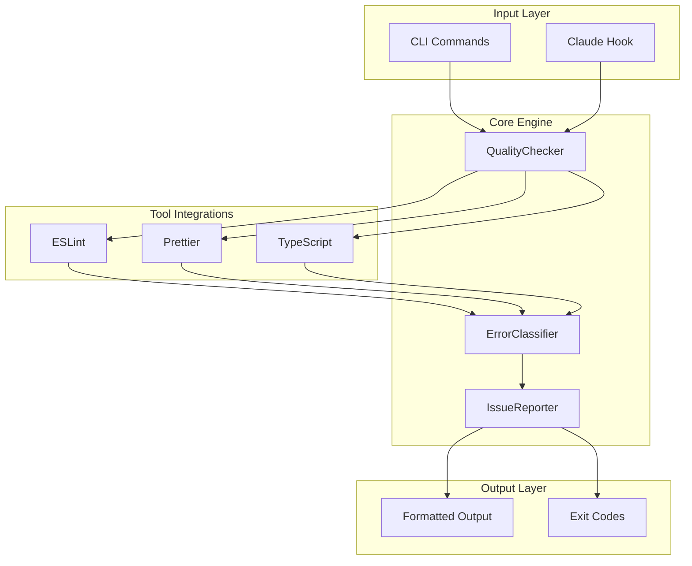

# Error Transparency System

## Comprehensive Specification v1.0

### September 2024

---

## 📋 Executive Summary

Enhance the existing quality-check implementation by providing detailed,
actionable error information to developers and AI assistants. This specification
defines a minimal but complete error classification and reporting system that
integrates seamlessly with the current Yanagi architecture.

### Key Objectives

1. **Full Transparency** - Capture and display all error details (file, line,
   column, message, rule)
2. **Actionable Feedback** - Clearly indicate which errors are auto-fixable vs
   manual
3. **Smart Exit Codes** - Use exit codes to communicate fix-ability
4. **Minimal Complexity** - Add only essential features, no over-engineering

---

## 🏗️ System Architecture

### Component Overview



### Data Flow

1. **Input** → QualityChecker receives file list and options
2. **Execution** → Runs ESLint, Prettier, TypeScript with detailed output
   capture
3. **Classification** → ErrorClassifier parses and categorizes errors
4. **Formatting** → IssueReporter formats for target consumer (CLI, Claude,
   JSON)
5. **Output** → Returns formatted results with appropriate exit code

---

## 🔍 Core Components

### 1. Error Classifier (`error-classifier.ts`)

#### Purpose

Parses raw error strings from various tools into structured, actionable data.

#### Key Interfaces

```typescript
interface ParsedError {
  code: string // Error code (e.g., 'TS2304', 'no-unused-vars')
  message: string // Human-readable message
  source: 'eslint' | 'prettier' | 'typescript'
  file: string // File path
  line: number // Line number (1-based)
  column: number // Column number (1-based)
  severity: 'error' | 'warning'
  fixable: boolean // Can be auto-fixed
}

interface ErrorClassification {
  totalErrors: number
  fixableErrors: ParsedError[]
  unfixableErrors: ParsedError[]
  warnings: ParsedError[]
  bySource: {
    eslint: ParsedError[]
    prettier: ParsedError[]
    typescript: ParsedError[]
  }
}
```

#### Parsing Patterns

| Tool       | Format                                     | Example                                                        |
| ---------- | ------------------------------------------ | -------------------------------------------------------------- |
| ESLint     | `file:line:column - message (rule-id)`     | `app.ts:10:5 - 'x' is defined but never used (no-unused-vars)` |
| TypeScript | `file(line,column): error TS####: message` | `app.ts(10,5): error TS2304: Cannot find name 'x'`             |
| Prettier   | `file - message`                           | `app.ts - File needs Prettier formatting`                      |

#### Auto-Fixable Rules

The classifier maintains a set of auto-fixable ESLint rules:

- Formatting: `semi`, `quotes`, `indent`, `comma-dangle`
- Spacing: `space-before-function-paren`, `object-curly-spacing`
- Whitespace: `no-trailing-spaces`, `eol-last`, `no-multiple-empty-lines`

All Prettier issues are considered auto-fixable. TypeScript errors are never
auto-fixable.

---

### 2. Quality Checker Enhancements

#### Error Capture Methods

##### ESLint Integration

```bash
npx eslint [files] --format=json
```

- Parses JSON output for structured error data
- Captures both errors (severity 2) and warnings (severity 1)
- Preserves rule IDs for fixability determination

##### TypeScript Integration

```bash
npx tsc --noEmit
```

- Parses compiler output line by line
- Extracts error codes, locations, and messages
- Handles multi-line error descriptions

##### Prettier Integration

```bash
npx prettier --check [file]
```

- Runs per-file to identify which files need formatting
- Binary result (formatted/not formatted)
- All issues are fixable with `--write`

#### Enhanced Result Structure

```typescript
interface QualityCheckResult {
  success: boolean
  checkers: {
    eslint?: CheckerResult
    prettier?: CheckerResult
    typescript?: CheckerResult
  }
  errors?: string[] // All raw error strings
  classification?: ErrorClassification // Parsed and classified errors
}

interface CheckerResult {
  success: boolean
  errors?: string[] // Detailed error messages
  warnings?: string[] // Warning messages
  fixable?: boolean // Tool can auto-fix
  summary?: string // Human-readable summary
}
```

---

### 3. Issue Reporter Enhancements

#### Output Formats

##### CLI Format (Human-Readable)

```
📊 Error Summary:
  Total: 5 errors
  Fixable: 3
  Manual fixes needed: 2

🔍 ESLint (3):
  src/app.ts:10:5
    no-unused-vars: 'config' is defined but never used
    💡 Auto-fixable

📘 TypeScript (2):
  src/app.ts:25:10
    TS2304: Cannot find name 'unknownVar'
```

##### Claude Format (Minimal, Actionable)

```
Manual fixes required:
src/app.ts:25 - TS2304: Cannot find name 'unknownVar'
src/app.ts:30 - TS2322: Type 'string' is not assignable to type 'number'
```

##### JSON Format (Programmatic)

```json
{
  "success": false,
  "classification": {
    "totalErrors": 5,
    "fixableErrors": [...],
    "unfixableErrors": [...],
    "warnings": [...]
  }
}
```

---

## 🚦 Exit Code Strategy

### Exit Code Meanings

| Code | Meaning         | Action Required | Example                             |
| ---- | --------------- | --------------- | ----------------------------------- |
| 0    | Success         | None            | All checks pass                     |
| 0    | Warnings only   | Optional        | ESLint warnings (non-blocking)      |
| 1    | Blocking errors | Manual fix      | TypeScript errors, unfixable ESLint |
| 2    | Fixable errors  | Run with --fix  | Formatting, fixable ESLint rules    |

### Decision Logic

```typescript
function getExitCode(classification: ErrorClassification): number {
  // Blocking errors (manual fix required)
  if (classification.unfixableErrors.length > 0) return 1

  // Auto-fixable errors exist
  if (classification.fixableErrors.length > 0) return 2

  // Only warnings or success
  return 0
}
```

---

## 🔧 Auto-Fix Strategy

### Fix Execution Order

1. **Prettier First** - Format code structure
2. **ESLint Second** - Fix linting issues
3. **Verify** - Re-run checks to confirm fixes

### Fix Reporting

```typescript
interface FixResult {
  success: boolean
  count: number // Number of tools that applied fixes
  fixed: string[] // Which tools applied fixes ['ESLint', 'Prettier']
  details?: string[] // Specific rules/changes applied
  error?: string // Error message if fix failed
}
```

### Fix Transparency

After auto-fix, the system reports:

- Which tools made changes
- What types of issues were fixed
- Any remaining issues that need manual attention

---

## 💻 Implementation Guide

### File Structure

```
yanagi/
├── src/
│   ├── core/
│   │   ├── quality-checker.ts    # Enhanced with error capture
│   │   ├── error-classifier.ts   # NEW: Error parsing and classification
│   │   └── issue-reporter.ts     # Enhanced with classification support
│   ├── types.ts                  # Enhanced type definitions
│   └── index.ts                  # Updated exports
```

### Integration Points

#### 1. Modify `quality-checker.ts`

- Update `runESLint()` to use JSON format (already done)
- Update `runTypeScript()` to parse compiler output
- Update `runPrettier()` to report specific files
- Add error classification after all checks

#### 2. Add `error-classifier.ts`

- Implement error parsing for all three tools
- Maintain fixable rules registry
- Provide classification and formatting methods

#### 3. Update `issue-reporter.ts`

- Use classification for intelligent formatting
- Implement format-specific outputs
- Calculate smart exit codes

#### 4. Update `types.ts`

- Add `ErrorClassification` type
- Extend `QualityCheckResult` with classification
- Add detailed error arrays to `CheckerResult`

---

## 🧪 Testing Strategy

### Unit Tests

#### Error Classifier Tests

```typescript
describe('ErrorClassifier', () => {
  it('should parse ESLint errors correctly', () => {
    const error = 'app.ts:10:5 - Variable is not defined (no-undef)'
    const parsed = classifier.parseError(error)
    expect(parsed.code).toBe('no-undef')
    expect(parsed.line).toBe(10)
    expect(parsed.fixable).toBe(false)
  })

  it('should classify errors by fixability', () => {
    const errors = [
      'app.ts:1:1 - Missing semicolon (semi)',
      'app.ts:2:1 - Cannot find name (TS2304)',
    ]
    const classification = classifier.classify(errors)
    expect(classification.fixableErrors).toHaveLength(1)
    expect(classification.unfixableErrors).toHaveLength(1)
  })
})
```

#### Integration Tests

```typescript
describe('Quality Check with Classification', () => {
  it('should provide detailed error information', async () => {
    const result = await checker.check(['test-file.ts'])
    expect(result.classification).toBeDefined()
    expect(result.classification.totalErrors).toBeGreaterThan(0)
    expect(result.errors[0]).toMatch(/:\d+:\d+/)
  })
})
```

### Test Scenarios

1. **Mixed Errors** - File with fixable and unfixable errors
2. **Tool-Specific** - Errors from single tool only
3. **Auto-Fix Flow** - Run fix and verify remaining errors
4. **Exit Codes** - Verify correct codes for different scenarios

---

## 📈 Success Metrics

### Quantitative Metrics

- **Error Detail Rate**: 100% of errors include file, line, column
- **Classification Accuracy**: 95%+ correct fixability determination
- **Fix Success Rate**: 90%+ of fixable errors resolved automatically
- **Performance Impact**: <100ms added latency for classification

### Qualitative Metrics

- **Developer Satisfaction**: Clear, actionable error messages
- **AI Comprehension**: Claude can understand and act on errors
- **Maintenance Burden**: Minimal code addition (~300 lines)

---

## 🚀 Rollout Plan

### Phase 1: Core Implementation (Week 1)

- [ ] Implement `error-classifier.ts`
- [ ] Update `quality-checker.ts` with error capture
- [ ] Enhance `issue-reporter.ts` with classification
- [ ] Update type definitions

### Phase 2: Testing & Refinement (Week 2)

- [ ] Add comprehensive unit tests
- [ ] Test with real-world projects
- [ ] Refine error parsing patterns
- [ ] Optimize performance

### Phase 3: Documentation & Release (Week 3)

- [ ] Update README with new features
- [ ] Add usage examples
- [ ] Create migration guide
- [ ] Release as minor version update

---

## 🔮 Future Enhancements

### Potential Features (Not in v1)

- **Error Deduplication** - Group identical errors
- **Custom Fix Rules** - User-defined auto-fixes
- **Error Trends** - Track error patterns over time
- **IDE Integration** - VS Code extension support
- **Caching** - Cache classification results

### Compatibility Considerations

- Maintain backward compatibility with existing CLI
- Support both old and new output formats
- Graceful degradation if classification fails

---

## 📚 Appendix

### A. Example Error Patterns

#### ESLint Errors

```
/Users/dev/app.ts:10:5 - 'config' is defined but never used. (no-unused-vars)
/Users/dev/app.ts:15:28 - Missing semicolon. (semi)
/Users/dev/app.ts:20:1 - Expected indentation of 2 spaces but found 4. (indent)
```

#### TypeScript Errors

```
src/app.ts(10,5): error TS2304: Cannot find name 'unknownVariable'.
src/app.ts(15,10): error TS2322: Type 'string' is not assignable to type 'number'.
src/app.ts(20,1): error TS1005: ';' expected.
```

#### Prettier Errors

```
src/app.ts - File needs Prettier formatting
src/components/Button.tsx - File needs Prettier formatting
```

### B. Configuration Options

```typescript
interface TransparencyOptions {
  // Classification options
  classification: {
    enabled: boolean // Enable error classification
    includeWarnings: boolean // Classify warnings too
    deduplication: boolean // Remove duplicate errors
  }

  // Output options
  output: {
    format: 'cli' | 'json' | 'claude'
    verbose: boolean // Include all details
    groupByFile: boolean // Group errors by file
    showFixHints: boolean // Show fix suggestions
  }

  // Fix options
  fix: {
    enabled: boolean // Allow auto-fixing
    verify: boolean // Re-run checks after fix
    sequential: boolean // Fix one tool at a time
  }
}
```

### C. Performance Benchmarks

| Operation        | Target | Acceptable |
| ---------------- | ------ | ---------- |
| Parse 100 errors | <50ms  | <100ms     |
| Classify errors  | <10ms  | <25ms      |
| Format output    | <5ms   | <10ms      |
| Total overhead   | <65ms  | <135ms     |

---

## ✅ Acceptance Criteria

The implementation is considered complete when:

1. ✅ All errors include file, line, column, and message
2. ✅ Errors are correctly classified as fixable/unfixable
3. ✅ Exit codes accurately reflect error state
4. ✅ Auto-fix reports what was changed
5. ✅ CLI output is clear and actionable
6. ✅ Claude format is minimal but complete
7. ✅ JSON format includes full classification
8. ✅ Performance overhead is <100ms
9. ✅ All tests pass with >90% coverage
10. ✅ Documentation is complete and accurate

---

_This specification defines a practical, implementable solution that enhances
Yanagi with error transparency while maintaining its simplicity and
effectiveness._
