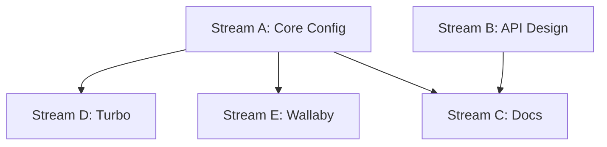

# Task 001 Analysis: Setup testkit package structure

## Current State Assessment

**Package Already Exists**: The testkit package is already present at `/packages/testkit` with:
- Basic package.json structure
- TypeScript configuration extending monorepo base
- Empty src/index.ts file
- Existing dependencies: vitest, convex-test, msw

## Parallel Streams

### Stream A: Core Configuration Updates
- **Files**: package.json, tsconfig.json, vitest.config.ts
- **Work**: Update dependencies, enhance TypeScript config, create Vitest configuration
- **Dependencies**: None (can start immediately)
- **Estimated Time**: 1-2 hours

### Stream B: Export Structure & API Design
- **Files**: src/index.ts, src/types.ts
- **Work**: Design and implement the public API exports
- **Dependencies**: None (can start immediately)
- **Estimated Time**: 1 hour

### Stream C: Documentation & Examples
- **Files**: README.md, examples/*.ts
- **Work**: Create usage documentation and example tests
- **Dependencies**: Streams A & B must be complete
- **Estimated Time**: 1-2 hours

### Stream D: Turbo Integration
- **Files**: ../../turbo.json
- **Work**: Add testkit to pipeline, configure caching
- **Dependencies**: Stream A must define scripts
- **Estimated Time**: 30 minutes

### Stream E: Wallaby Configuration
- **Files**: wallaby.config.js (package level)
- **Work**: Create Wallaby-specific configuration
- **Dependencies**: Stream A vitest config
- **Estimated Time**: 1 hour

## Dependencies Graph


## Integration Points

1. **Root package.json**: Already includes testkit in workspace
2. **Turbo.json**: Needs pipeline configuration for test commands
3. **tsconfig.json references**: May need path mappings for @repo/testkit
4. **CI workflows**: Will need test job configuration

## File Patterns

```
packages/testkit/
├── package.json          [Stream A]
├── tsconfig.json         [Stream A]
├── vitest.config.ts      [Stream A - NEW]
├── wallaby.config.js     [Stream E - NEW]
├── README.md             [Stream C - NEW]
├── src/
│   ├── index.ts         [Stream B]
│   └── types.ts         [Stream B - NEW]
└── examples/            [Stream C - NEW]
    ├── basic.test.ts
    └── advanced.test.ts
```

## Implementation Details

### Stream A Specifics
- Add missing dev dependencies: @vitest/ui, @vitest/coverage-v8
- Configure test globals in tsconfig
- Setup vitest with proper test patterns and coverage

### Stream B Specifics
- Export MSW utilities from src/msw
- Export container helpers (future tasks)
- Export test utilities and matchers
- Define shared types for test context

## Risk Mitigation

- **Risk**: Breaking existing imports
  - **Mitigation**: Maintain backward compatibility in exports
- **Risk**: Version conflicts with monorepo
  - **Mitigation**: Use workspace protocol for internal deps