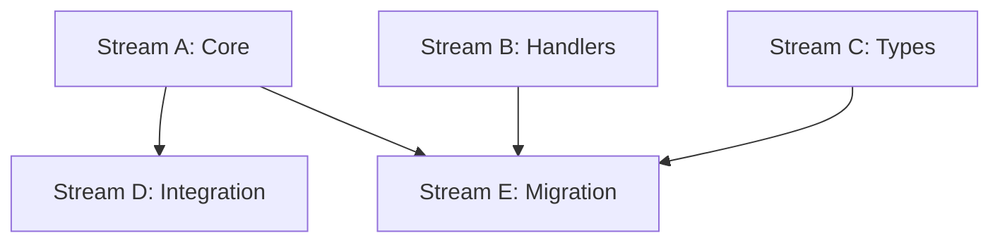

# Task 002 Analysis: Implement MSW server configuration

## Current State Assessment

**Partial Implementation Exists**:

- `/packages/testkit/src/msw/index.ts`: Has placeholder comments, needs
  completion
- `/apps/vite/src/mocks/server.ts`: Working example to reference
- MSW already installed as dependency in testkit

## Critical Issues Found

1. **Duplicated MSW Setup**: Vite app has its own server setup
2. **Incomplete Implementation**: Testkit MSW files have placeholders
3. **No Global Configuration**: Missing vitest globalSetup for automatic
   lifecycle
4. **Loose Error Handling**: Vite uses 'warn' instead of 'error'
5. **Missing Type Safety**: No typed mock builders or factories

## Parallel Streams

### Stream A: Core MSW Infrastructure

- **Files**: src/msw/setup.ts, src/msw/server.ts, src/msw/config.ts
- **Work**: Create singleton server, lifecycle management, global configuration
- **Dependencies**: None (critical path)
- **Estimated Time**: 2-3 hours

### Stream B: Handler Utilities & Builders

- **Files**: src/msw/handlers.ts, src/msw/builders.ts
- **Work**: Create reusable handler patterns, response builders
- **Dependencies**: None (can run parallel to A)
- **Estimated Time**: 2 hours

### Stream C: Type-Safe Mock Data

- **Files**: src/msw/factories.ts, src/msw/types.ts
- **Work**: Create data factories with full type safety
- **Dependencies**: None (can run parallel to A)
- **Estimated Time**: 2 hours

### Stream D: Test Integration Layer

- **Files**: vitest.globalSetup.ts, vitest.globalTeardown.ts
- **Work**: Automatic server lifecycle, environment setup
- **Dependencies**: Stream A must complete first
- **Estimated Time**: 1 hour

### Stream E: Migration & Cleanup

- **Files**: apps/vite/src/mocks/\*, migration docs
- **Work**: Migrate vite to use testkit, remove duplication
- **Dependencies**: All streams complete
- **Estimated Time**: 1 hour

## Dependencies Graph



## Integration Points

1. **Vitest Config**: Update to use globalSetup/Teardown
2. **Package Exports**: Ensure all utilities exported from index.ts
3. **Vite App**: Migrate to use testkit implementation
4. **Environment Variables**: MSW_MODE for different behaviors

## File Patterns

```
packages/testkit/
├── src/msw/
│   ├── index.ts          [Update - Stream A]
│   ├── setup.ts          [NEW - Stream A]
│   ├── server.ts         [NEW - Stream A]
│   ├── config.ts         [NEW - Stream A]
│   ├── handlers.ts       [NEW - Stream B]
│   ├── builders.ts       [NEW - Stream B]
│   ├── factories.ts      [NEW - Stream C]
│   └── types.ts          [NEW - Stream C]
├── vitest.globalSetup.ts [NEW - Stream D]
└── vitest.globalTeardown.ts [NEW - Stream D]
```

## Implementation Strategy

### Stream A: Core Infrastructure

```typescript
// server.ts - Singleton pattern
let server: SetupServerApi | null = null;
export function getMSWServer(config?: MSWConfig) { ... }

// setup.ts - Lifecycle hooks
export function setupMSW() {
  beforeAll(() => server.listen())
  afterEach(() => server.resetHandlers())
  afterAll(() => server.close())
}
```

### Stream B: Handler Utilities

```typescript
// Common patterns
export const createCRUDHandlers = (resource: string) => [...]
export const createAuthHandlers = () => [...]
export const delayedResponse = (ms: number) => [...]
```

### Stream C: Type-Safe Factories

```typescript
// Full type inference
export const createUser = factory<User>({...})
export const createPost = factory<Post>({...})
```

## Risk Mitigation

- **Risk**: Breaking existing vite tests
  - **Mitigation**: Gradual migration, maintain compatibility
- **Risk**: Handler conflicts
  - **Mitigation**: Namespace handlers by package
- **Risk**: Performance impact
  - **Mitigation**: Lazy loading, conditional setup

## Success Metrics

- Zero test failures after migration
- < 100ms server startup time
- 100% type coverage on mock data
- No duplicate handler definitions
