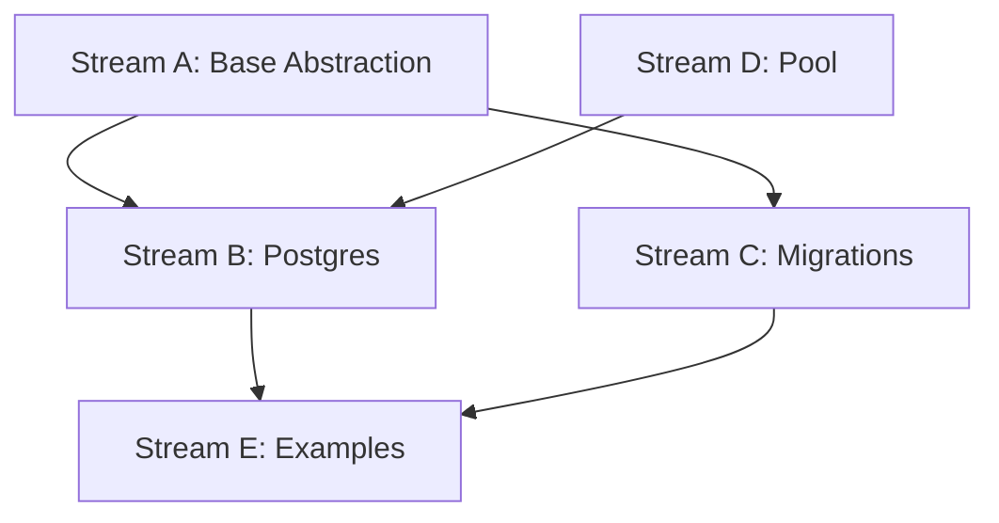

# Task 003 Analysis: Create Testcontainers helpers for Postgres

## Current State Assessment

**No Testcontainers Implementation**:

- No existing database testing utilities in testkit
- No Testcontainers dependencies installed
- No Docker configuration for testing

## Parallel Streams

### Stream A: Shared Database Abstraction

- **Files**: src/containers/base-database.ts, src/containers/types.ts
- **Work**: Create abstract base class for database containers (shared with
  Task 004)
- **Dependencies**: None
- **Estimated Time**: 2-3 hours

### Stream B: Postgres-Specific Implementation

- **Files**: src/containers/postgres.ts, src/containers/postgres-config.ts
- **Work**: Postgres container wrapper, connection management, extensions
- **Dependencies**: Stream A for base class
- **Estimated Time**: 2 hours

### Stream C: Migration & Seeding Utilities

- **Files**: src/containers/migrations.ts, src/containers/seeders.ts
- **Work**: Generic migration runner, data seeding patterns
- **Dependencies**: Stream A for types
- **Estimated Time**: 2 hours

### Stream D: Connection Pool Management

- **Files**: src/containers/pool.ts, src/containers/cleanup.ts
- **Work**: Connection pooling, resource cleanup hooks
- **Dependencies**: None (can run parallel)
- **Estimated Time**: 1-2 hours

### Stream E: Test Fixtures & Examples

- **Files**: fixtures/postgres/\*, examples/postgres.test.ts
- **Work**: Sample schemas, test data, usage examples
- **Dependencies**: Streams B & C complete
- **Estimated Time**: 1 hour

## Dependencies Graph



## Shared Abstraction with Task 004

### Base Database Container

```typescript
abstract class BaseDatabaseContainer<T> {
  abstract getConnectionString(): string
  abstract getPort(): number
  abstract waitForReady(): Promise<void>
  abstract runMigrations(path: string): Promise<void>
  abstract seed(data: any): Promise<void>
  abstract cleanup(): Promise<void>
}
```

### Shared Types

```typescript
interface DatabaseConfig {
  image: string
  port: number
  database: string
  username: string
  password: string
  environment?: Record<string, string>
}

interface TestContext<T> {
  container: T
  connectionString: string
  cleanup: () => Promise<void>
}
```

## Integration Points

1. **Vitest Setup**: Global fixtures for container lifecycle
2. **Wallaby Config**: Container reuse across test runs
3. **CI Configuration**: Docker service requirements
4. **Resource Management**: Automatic cleanup hooks

## File Patterns

```
packages/testkit/
├── src/containers/
│   ├── base-database.ts    [Stream A - SHARED]
│   ├── types.ts            [Stream A - SHARED]
│   ├── postgres.ts         [Stream B]
│   ├── postgres-config.ts  [Stream B]
│   ├── migrations.ts       [Stream C - SHARED]
│   ├── seeders.ts         [Stream C - SHARED]
│   ├── pool.ts            [Stream D - SHARED]
│   └── cleanup.ts         [Stream D - SHARED]
├── fixtures/postgres/
│   ├── schema.sql         [Stream E]
│   └── test-data.sql      [Stream E]
└── examples/
    └── postgres.test.ts   [Stream E]
```

## Postgres-Specific Features

1. **Extensions Support**: postgis, pgvector, uuid-ossp
2. **Schema Management**: Multiple schemas per test
3. **Advanced Types**: JSONB, arrays, custom types
4. **Performance**: COPY commands for bulk inserts
5. **Replication**: Read replicas for testing

## Implementation Strategy

### Quick Start API

```typescript
// Simple one-liner setup
const { db, cleanup } = await setupPostgresTest({
  migrations: './migrations',
  seed: './fixtures/seed.sql',
})

// Advanced configuration
const context = await createPostgresContext({
  version: '15-alpine',
  extensions: ['pgvector', 'postgis'],
  initScripts: ['./init.sql'],
  poolSize: 5,
})
```

### Resource Management

```typescript
// Automatic cleanup in afterEach/afterAll
beforeAll(async () => {
  context = await setupPostgres()
})

afterAll(async () => {
  await context.cleanup() // Ensures no dangling containers
})
```

## Risk Mitigation

- **Risk**: Container startup failures
  - **Mitigation**: Retry logic with exponential backoff
- **Risk**: Port conflicts
  - **Mitigation**: Dynamic port allocation
- **Risk**: Resource leaks
  - **Mitigation**: Forced cleanup in global teardown

## Success Metrics

- Container startup < 5 seconds
- Zero resource leaks after test runs
- Support for parallel test execution
- Reusable containers in watch mode
