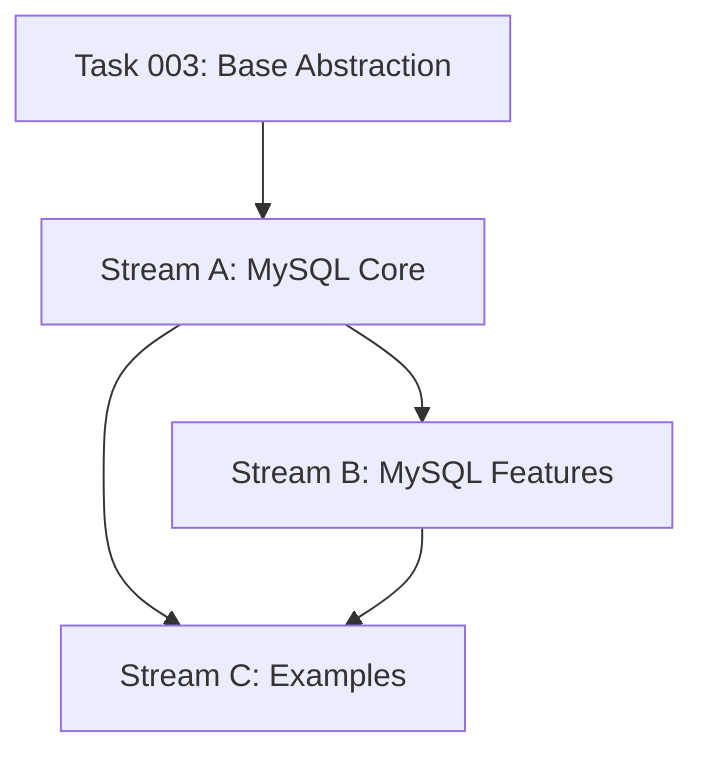

# Task 004 Analysis: Create Testcontainers helpers for MySQL

## Current State Assessment

**No Testcontainers Implementation**:
- No existing database testing utilities in testkit
- Shares ~80% implementation with Task 003 (Postgres)
- Can reuse base abstraction from Task 003

## Parallel Streams

### Stream A: MySQL-Specific Implementation
- **Files**: src/containers/mysql.ts, src/containers/mysql-config.ts
- **Work**: MySQL container wrapper, connection management, charset config
- **Dependencies**: Base abstraction from Task 003 Stream A
- **Estimated Time**: 2 hours

### Stream B: MySQL-Specific Features
- **Files**: src/containers/mysql-features.ts
- **Work**: SQL modes, character sets, replication setup
- **Dependencies**: Stream A
- **Estimated Time**: 1-2 hours

### Stream C: Test Fixtures & Examples
- **Files**: fixtures/mysql/*, examples/mysql.test.ts
- **Work**: Sample schemas, test data, usage examples
- **Dependencies**: Stream A complete
- **Estimated Time**: 1 hour

## Dependencies Graph


## Shared Components from Task 003

### Reused from Base Abstraction
- `BaseDatabaseContainer` class
- `DatabaseConfig` interface
- `TestContext` interface
- Migration runner
- Seeding utilities
- Connection pool management
- Cleanup hooks

### MySQL-Specific Extensions
```typescript
class MySQLContainer extends BaseDatabaseContainer<MySQLConnection> {
  // MySQL-specific overrides
  setSQLMode(mode: string): void
  setCharacterSet(charset: string): void
  enableSlowQueryLog(): void
  setupReplication(): Promise<void>
}
```

## Integration Points

1. **Shared Base**: Extends Task 003's base abstraction
2. **Common Utilities**: Reuses migrations, seeders, pools
3. **Vitest Integration**: Same lifecycle patterns as Postgres
4. **Docker Compose**: Can run alongside Postgres containers

## File Patterns

```
packages/testkit/
├── src/containers/
│   ├── mysql.ts           [Stream A]
│   ├── mysql-config.ts    [Stream A]
│   └── mysql-features.ts  [Stream B]
├── fixtures/mysql/
│   ├── schema.sql         [Stream C]
│   └── test-data.sql      [Stream C]
└── examples/
    └── mysql.test.ts      [Stream C]
```

## MySQL-Specific Features

1. **SQL Modes**: STRICT_ALL_TABLES, NO_ZERO_DATE
2. **Character Sets**: utf8mb4, collations
3. **Storage Engines**: InnoDB, MyISAM testing
4. **Replication**: Master-slave setup for testing
5. **Performance**: Query cache, slow query log

## Implementation Strategy

### Quick Start API
```typescript
// Simple setup (mirrors Postgres API)
const { db, cleanup } = await setupMySQLTest({
  migrations: './migrations',
  seed: './fixtures/seed.sql'
})

// MySQL-specific configuration
const context = await createMySQLContext({
  version: '8.0',
  characterSet: 'utf8mb4',
  sqlMode: 'STRICT_ALL_TABLES',
  enableSlowQueryLog: true
})
```

### Feature Parity with Postgres
```typescript
// Same API surface for consistency
interface DatabaseTestHelpers {
  setupPostgresTest(config): Promise<TestContext>
  setupMySQLTest(config): Promise<TestContext>
  // Shared interface, different implementations
}
```

## Differences from Postgres

| Feature | Postgres | MySQL |
|---------|----------|--------|
| Default Port | 5432 | 3306 |
| Connection Library | pg | mysql2 |
| Schema Support | Multiple schemas | Database = schema |
| Extensions | CREATE EXTENSION | Built-in features |
| Arrays | Native support | JSON arrays |
| JSONB | Native | JSON type |

## Risk Mitigation

- **Risk**: Version incompatibilities
  - **Mitigation**: Support MySQL 5.7 and 8.0
- **Risk**: Character encoding issues
  - **Mitigation**: Default to utf8mb4
- **Risk**: SQL mode conflicts
  - **Mitigation**: Configurable modes per test

## Success Metrics

- API consistency with Postgres helpers
- < 5 second container startup
- Support for MySQL 5.7 and 8.0
- Zero test interference between runs