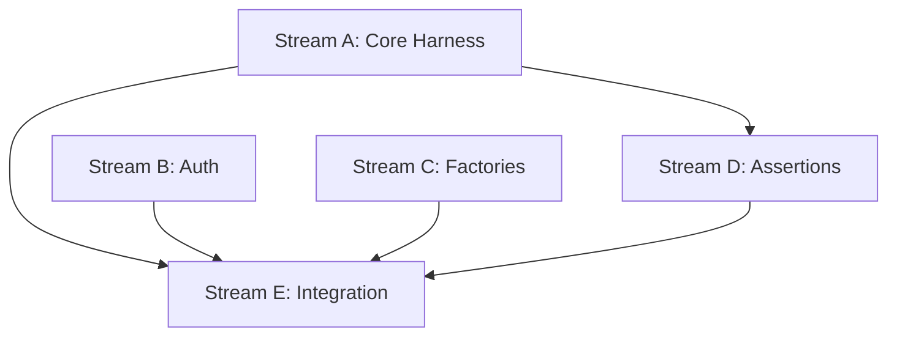

# Task 005 Analysis: Establish Convex test harness

## Current State Assessment

**Convex-test Package Installed**:

- Package already has `convex-test: ^0.0.38` dependency
- No test harness implementation yet
- Different paradigm from containerized databases (mocked vs real)

## Parallel Streams

### Stream A: Core Test Harness

- **Files**: src/convex/harness.ts, src/convex/context.ts
- **Work**: Test context setup, Convex client mocking, lifecycle management
- **Dependencies**: None (can start immediately)
- **Estimated Time**: 2-3 hours

### Stream B: Mock Authentication

- **Files**: src/convex/auth.ts, src/convex/providers.ts
- **Work**: Mock auth providers (Clerk, Auth0, custom), session management
- **Dependencies**: None (can run parallel)
- **Estimated Time**: 2 hours

### Stream C: Data Factory System

- **Files**: src/convex/factories.ts, src/convex/builders.ts
- **Work**: Type-safe data factories, relationship builders
- **Dependencies**: None (can run parallel)
- **Estimated Time**: 2 hours

### Stream D: Assertion Helpers

- **Files**: src/convex/matchers.ts, src/convex/assertions.ts
- **Work**: Custom Vitest matchers for Convex queries/mutations
- **Dependencies**: Stream A for types
- **Estimated Time**: 1-2 hours

### Stream E: Integration & Examples

- **Files**: src/convex/index.ts, examples/convex.test.ts
- **Work**: API exports, usage examples, best practices
- **Dependencies**: All streams complete
- **Estimated Time**: 1 hour

## Dependencies Graph



## Integration Points

1. **Convex-test Library**: Build on top of existing package
2. **Vitest Integration**: Custom matchers and fixtures
3. **Type Safety**: Full TypeScript inference for schemas
4. **Wallaby Support**: Fast feedback for Convex tests

## File Patterns

```
packages/testkit/
├── src/convex/
│   ├── harness.ts        [Stream A]
│   ├── context.ts        [Stream A]
│   ├── auth.ts           [Stream B]
│   ├── providers.ts      [Stream B]
│   ├── factories.ts      [Stream C]
│   ├── builders.ts       [Stream C]
│   ├── matchers.ts       [Stream D]
│   ├── assertions.ts     [Stream D]
│   └── index.ts          [Stream E]
└── examples/
    └── convex.test.ts    [Stream E]
```

## Convex-Specific Features

### Test Context API

```typescript
interface ConvexTestContext {
  db: DatabaseReader & DatabaseWriter
  auth: AuthMock
  storage: StorageMock
  scheduler: SchedulerMock
  // Reset between tests
  reset(): Promise<void>
  // Seed with factories
  seed(factories: Factory[]): Promise<void>
}
```

### Mock Authentication

```typescript
// Multiple auth provider support
const auth = createAuthMock({
  provider: 'clerk',
  userId: 'user_123',
  sessionClaims: { ... }
})

// Easy user switching
await auth.switchUser('user_456')
```

### Data Factories

```typescript
// Type-safe factories from schema
const userFactory = createFactory<'users'>({
  name: faker.name.fullName,
  email: faker.internet.email,
  // Auto-generate relations
  posts: hasMany('posts', 3),
})
```

### Custom Assertions

```typescript
// Convex-specific matchers
expect(ctx).toHaveDocument('users', { email: 'test@example.com' })
expect(query).toReturnWithin(100) // ms
expect(mutation).toInvalidateQuery('listPosts')
```

## Implementation Strategy

### Simple Setup

```typescript
// One-line test setup
const ctx = await setupConvexTest({
  schema: './convex/schema.ts',
  modules: './convex',
})

// With auth and seeding
const ctx = await setupConvexTest({
  auth: mockClerkAuth({ userId: 'test' }),
  seed: [createUsers(5), createPosts(10)],
})
```

### Test Isolation

```typescript
beforeEach(async () => {
  // Automatic reset between tests
  ctx = await createConvexContext()
})

afterEach(async () => {
  // Cleanup managed internally
  await ctx.cleanup()
})
```

## Differences from Database Testing

| Aspect           | Database Containers | Convex Harness         |
| ---------------- | ------------------- | ---------------------- |
| Approach         | Real instances      | Mocked backend         |
| Startup Time     | 3-5 seconds         | < 100ms                |
| Data Persistence | Real database       | In-memory              |
| Network          | Docker networking   | Direct function calls  |
| Use Case         | Integration tests   | Unit/integration tests |

## Risk Mitigation

- **Risk**: Schema drift from production
  - **Mitigation**: Import actual schema files
- **Risk**: Missing Convex features
  - **Mitigation**: Progressive enhancement as needed
- **Risk**: Type safety loss
  - **Mitigation**: Generate types from schema

## Success Metrics

- Test setup < 100ms
- Full type safety with schema
- Support for all Convex primitives
- Zero flake rate in tests
