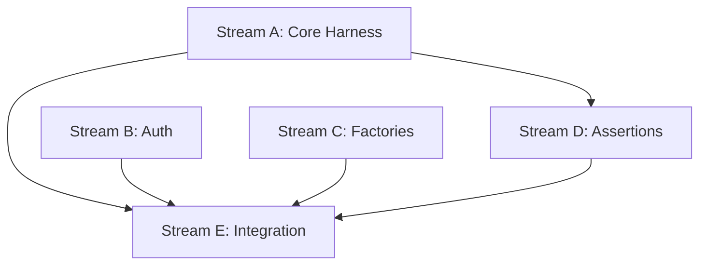

# Task 005 Analysis: Establish Convex test harness

## Current State Assessment

### Code present + dependency installed

- `convex-test: ^0.0.38` is installed and referenced
- Initial harness exists under `packages/testkit/src/convex/*`:
  - `harness.ts`, `context.ts`, `auth.ts`, `providers.ts`, `factories.ts`,
    `builders.ts`, `matchers.ts`, `index.ts`
- Gaps identified in review:
  - Identity application inconsistencies (global vs fluent)
  - Scheduler cleanup doesn’t advance timers (risk for in-flight chains)
  - Stubbed helpers (`getAllDocuments`, `countDocuments`, pending/cancel/advance
    time)
  - Storage helpers diverge from convex-test path via `ctx.storage` in `t.run`

Conclusion: A functional base exists; we need a clear strategy to finish and
stabilize it around convex-test’s documented patterns.

References (Context7):

- Auth: `t.withIdentity(...)`
- Seeding/inspect: `t.run(ctx => ...)`
- Scheduler: `vi.useFakeTimers()` + `vi.runAllTimers()` +
  `t.finishInProgressScheduledFunctions()` /
  `t.finishAllScheduledFunctions(vi.runAllTimers)`
- HTTP actions: `t.fetch('/path', opts)`

## Grand Plan (Strategy)

We will keep convex-test as the engine and expose a thin, reliable adapter that
codifies our monorepo conventions. The adapter will strictly delegate to
convex-test and provide sugar only where fidelity is guaranteed. We’ll add a
minimal fallback provider later if needed.

Guiding principles

- Build on convex-test; don’t re‑implement Convex
- Prefer small, fully reliable APIs over broad/stubbed ones
- Be explicit about identity semantics (fluent vs mutating)
- Pair scheduler assertions with fake timers; never “guess” pending state
- Keep storage interactions via `ctx.storage` within `t.run` for fidelity

Milestones

1. M0 – Adapter hardening (P0 fixes)

- Fix identity wiring (`createAuthenticatedConvexTest`, `lifecycle.reset`)
- Remove/throw for stub APIs (no silent `[]`/`0` returns)
- Cleanup accepts `advanceTimers` and documents usage
- Add smoke tests: `t.run`, identity, scheduled chains, `t.fetch`

1. M1 – Developer ergonomics

- `setUser/clearUser` (mutating) + documented fluent pattern (`withUser`)
- Seed helpers using `t.run` and simple factories (deterministic when seed
  configured)
- Modules example via `import.meta.glob` + `convexTest(schema, modules)`

1. M2 – Docs + templates

- Cookbook examples (auth, seeding, scheduler, HTTP actions, file uploads)
- Wallaby/Vitest config notes (edge-runtime for Convex tests via
  environmentMatchGlobs, setupFiles)
- Policies: when to use convex-test vs integration DB containers

1. M3 – Optional fallback

- Minimal in‑memory fallback provider (no scheduler), used only for ultra‑fast
  unit tests; clearly documented limitations

Success criteria

- Unit tests demonstrate identity isolation, scheduled chains, and HTTP actions;
  all green locally and in CI
- No stubbed helpers remain in public API
- Harness usage mirrors convex-test docs to reduce cognitive load

## Workstreams (updated)

### Stream A: Core Adapter Hardening (M0)

- **Files**: src/convex/harness.ts, src/convex/context.ts
- **Work**: Identity wiring, scheduler cleanup advancer, stub removal/throws,
  storage alignment via `t.run(ctx.storage)`
- **Dependencies**: None
- **Estimated Time**: 2–3 hours

### Stream B: Mock Authentication (M1)

- **Files**: src/convex/auth.ts, src/convex/providers.ts
- **Work**: Fluent vs mutating identity APIs, test user factories with common
  claims (name/email/role)
- **Dependencies**: Stream A
- **Estimated Time**: 2 hours

### Stream C: Seeding & Factories (M1)

- **Files**: src/convex/factories.ts, src/convex/builders.ts
- **Work**: Seed helpers over `t.run`, deterministic defaults (honor TEST_SEED),
  light factories; no overreach into ORM-like features
- **Dependencies**: Stream A
- **Estimated Time**: 2 hours

### Stream D: Assertion Helpers (M2)

- **Files**: src/convex/matchers.ts, src/convex/assertions.ts
- **Work**: Minimal matchers that wrap Vitest + convex-test flows (e.g.,
  `toCompleteWithin`, `toMatchObject` sugar). Avoid mocking internals.
- **Dependencies**: Stream A for types
- **Estimated Time**: 1–2 hours

### Stream E: Integration & Examples (M2)

- **Files**: src/convex/index.ts, examples/convex.test.ts
- **Work**: API exports, cookbook examples (auth, seeding, scheduler, HTTP),
  modules loading
- **Dependencies**: Streams A–D
- **Estimated Time**: 1 hour

## Dependencies Graph



## Integration Points

1. **convex-test**: Always the engine (adapter delegates)
2. **Vitest**: edge-runtime for Convex tests; use fake timers for scheduler
   tests
3. **Type Safety**: Prefer generated `_generated/api`/`_generated/server` in
   consumer tests; adapter stays generic
4. **Wallaby**: Mirrors Vitest config to avoid env drift (use
   environmentMatchGlobs to run convex/\*\* in edge-runtime)

## File Patterns

```text
packages/testkit/
├── src/convex/
│   ├── harness.ts        [Stream A]
│   ├── context.ts        [Stream A]
│   ├── auth.ts           [Stream B]
│   ├── providers.ts      [Stream B]
│   ├── factories.ts      [Stream C]
│   ├── builders.ts       [Stream C]
│   ├── matchers.ts       [Stream D]
│   ├── assertions.ts     [Stream D]
│   └── index.ts          [Stream E]
└── examples/
    └── convex.test.ts    [Stream E]
```

## Adapter Surface (Convex-Specific Features)

### Test Context API

```typescript
interface ConvexTestContext {
  convex: TestConvex
  db: { run; seed; clear }
  auth: { withUser; withoutAuth; setUser?; clearUser?; testUsers }
  storage: { via ctx.storage; helpers mirror behavior }
  scheduler: { finishInProgress; finishAll(advanceTimers) }
  lifecycle: { reset; cleanup }
}
```

### Mock Authentication

```typescript
// Fluent (scoped accessor)
const asUser = ctx.auth.withUser({ subject: 'user_123', name: 'Dev' })
await asUser.mutation(api.tasks.create, { text: 'hi' })

// Mutating (global) — optional convenience when tests prefer it
ctx.auth.setUser?.({ subject: 'user_456' })
```

### Data Factories

```typescript
// Seed via t.run for fidelity; factories kept intentionally light
await ctx.db.seed(async (c) => {
  await c.db.insert('users', { name: 'Test', email: 't@example.com' })
})
```

### Custom Assertions (minimal)

```typescript
// Prefer Vitest assertions, add light sugar where valuable
expect(result).toMatchObject({ text: 'Add tests' })
await expectQuery(...).toCompleteWithin(100)
```

## Implementation Strategy (refs to convex-test)

### Simple Setup

```typescript
const ctx = setupConvexTest({ schema, modules })
const asLee = ctx.auth.withUser({ name: 'Lee' })
await asLee.mutation(api.tasks.create, { text: 'Add tests' })
```

### Test Isolation

```typescript
beforeEach(async () => {
  await ctx.lifecycle.reset()
})

afterEach(async () => {
  // If using fake timers in a test, advance time and call
  // ctx.scheduler.finishAll(vi.runAllTimers) or t.finishAllScheduledFunctions(vi.runAllTimers)
  // within the test before cleanup
  await ctx.lifecycle.cleanup()
})
```

## Differences from Database Testing

| Aspect           | Database Containers | Convex Harness         |
| ---------------- | ------------------- | ---------------------- |
| Approach         | Real instances      | Mocked backend         |
| Startup Time     | 3-5 seconds         | < 100ms                |
| Data Persistence | Real database       | In-memory              |
| Network          | Docker networking   | Direct function calls  |
| Use Case         | Integration tests   | Unit/integration tests |

## Risk Mitigation

- **Risk**: Schema drift from production
  - **Mitigation**: Import actual schema and use generated types in consumers
- **Risk**: Library maintenance/usage levels
  - **Mitigation**: Keep adapter thin; pin versions; add smoke tests; be ready
    to fork if needed
- **Risk**: Type safety loss
  - **Mitigation**: Encourage `_generated/api`/`_generated/server` usage in
    tests

## Success Metrics

- Setup < 100ms; identity isolation proven in tests
- Scheduler chains complete deterministically under fake timers
- HTTP actions tested via `t.fetch`
- No stubbed APIs in public surface
