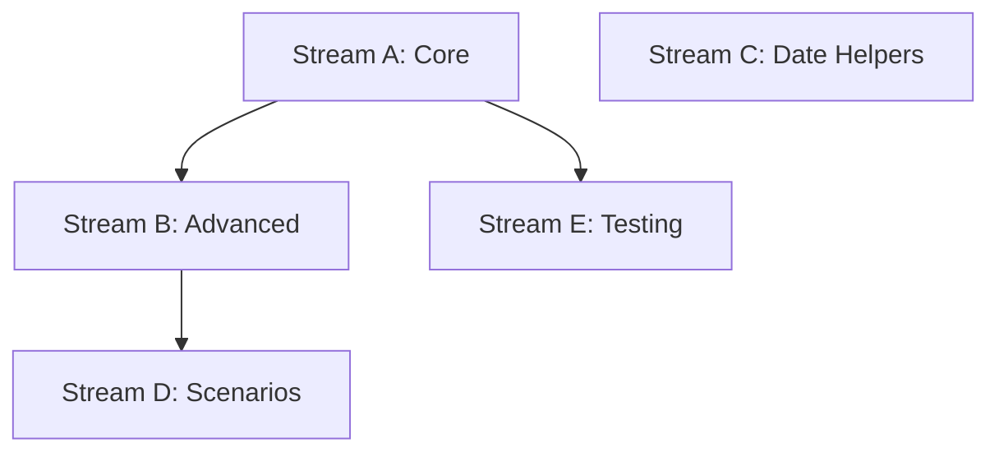

# Task 007 Analysis: Implement fake timers utilities

## Current State Assessment

**No Existing Implementation**:

- No fake timer utilities in testkit package
- No time manipulation helpers
- No date/timezone testing utilities
- Clean slate for implementation

## Parallel Streams

### Stream A: Core Timer Utilities

- **Files**: `src/env/fake-time.ts`, `src/env/types.ts`
- **Work**: Basic fake timer wrappers, system time control, cleanup mechanisms
- **Dependencies**: None
- **Estimated Time**: 1-2 hours

### Stream B: Advanced Timer Features

- **Files**: `src/env/fake-time-async.ts`, `src/env/timer-queue.ts`
- **Work**: Async timer handling, advancement strategies, timer queue management
- **Dependencies**: Stream A for base utilities
- **Estimated Time**: 2 hours

### Stream C: Date & Time Helpers

- **Files**: `src/env/date-helpers.ts`, `src/env/timezone.ts`
- **Work**: Timezone testing, date formatting, relative time helpers
- **Dependencies**: None (can run parallel)
- **Estimated Time**: 1-2 hours

### Stream D: Common Test Scenarios

- **Files**: `src/env/time-scenarios.ts`, `src/env/patterns.ts`
- **Work**: Pre-built patterns for timeout, debounce, throttle, scheduled jobs
- **Dependencies**: Streams A & B complete
- **Estimated Time**: 2 hours

### Stream E: Documentation & Testing

- **Files**: `src/env/__tests__/*.test.ts`, `docs/fake-timers.md`
- **Work**: Comprehensive tests, usage documentation, examples
- **Dependencies**: Stream A complete to start testing
- **Estimated Time**: 1-2 hours

## Dependencies Graph



## Implementation Details

### Core Timer API (Stream A)

```typescript
export interface FakeTimerContext {
  advance: (ms: number) => void
  advanceAsync: (ms: number) => Promise<void>
  runAll: () => void
  runAllAsync: () => Promise<void>
  restore: () => void
  getTimerCount: () => number
}

export function useFakeTimers(options?: FakeTimerOptions): FakeTimerContext {
  vi.useFakeTimers(options)
  return {
    advance: (ms) => vi.advanceTimersByTime(ms),
    advanceAsync: async (ms) => await vi.advanceTimersByTimeAsync(ms),
    runAll: () => vi.runAllTimers(),
    runAllAsync: async () => await vi.runAllTimersAsync(),
    restore: () => vi.useRealTimers(),
    getTimerCount: () => vi.getTimerCount(),
  }
}
```

### Advanced Features (Stream B)

```typescript
export class TimerController {
  private queue: Timer[] = []

  scheduleTimer(fn: () => void, delay: number, type: 'timeout' | 'interval') {
    // Track and manage timers
  }

  async advanceToNext() {
    // Advance to next timer
  }

  async advanceBySteps(steps: number) {
    // Step through timers one by one
  }
}
```

### Date Helpers (Stream C)

```typescript
export const dateHelpers = {
  setFixedDate: (date: Date | string) => {
    vi.setSystemTime(date)
  },

  mockTimezone: (tz: string) => {
    process.env.TZ = tz
  },

  createRelativeDate: (offset: string) => {
    // "2 hours from now", "3 days ago"
  },

  freezeTime: () => {
    // Stop time progression
  },
}
```

### Common Scenarios (Stream D)

```typescript
export const timeScenarios = {
  testDebounce: async (fn: Function, delay: number) => {
    const timers = useFakeTimers()
    // Test debounce pattern
  },

  testThrottle: async (fn: Function, limit: number) => {
    // Test throttle pattern
  },

  testScheduledJob: async (schedule: string, fn: Function) => {
    // Test cron-like jobs
  },

  testRetryWithBackoff: async (fn: Function, config: RetryConfig) => {
    // Test exponential backoff
  },
}
```

## Integration Points

1. **Vitest Configuration**: Integrate with base config for auto-cleanup
2. **Environment Detection**: Different behavior for CI/local/Wallaby
3. **Test Lifecycle**: Automatic restoration in afterEach hooks
4. **Type Safety**: Full TypeScript support with proper types

## File Patterns

```
packages/testkit/
├── src/env/
│   ├── fake-time.ts          [Stream A]
│   ├── fake-time-async.ts    [Stream B]
│   ├── timer-queue.ts        [Stream B]
│   ├── date-helpers.ts       [Stream C]
│   ├── timezone.ts           [Stream C]
│   ├── time-scenarios.ts     [Stream D]
│   ├── patterns.ts           [Stream D]
│   └── __tests__/
│       ├── fake-time.test.ts [Stream E]
│       └── scenarios.test.ts [Stream E]
├── docs/
│   └── fake-timers.md        [Stream E]
└── examples/
    └── timer-tests/           [Stream E]
```

## Usage Examples

### Basic Timer Control

```typescript
it('should handle timeout', () => {
  const timers = useFakeTimers()
  const callback = vi.fn()

  setTimeout(callback, 1000)
  timers.advance(999)
  expect(callback).not.toHaveBeenCalled()

  timers.advance(1)
  expect(callback).toHaveBeenCalledOnce()

  timers.restore()
})
```

### Async Operations

```typescript
it('should handle async timers', async () => {
  const timers = useFakeTimers()

  const promise = new Promise((resolve) => {
    setTimeout(() => resolve('done'), 1000)
  })

  await timers.advanceAsync(1000)
  await expect(promise).resolves.toBe('done')
})
```

### Date Manipulation

```typescript
it('should freeze time', () => {
  const fixedDate = new Date('2024-01-01T12:00:00Z')
  dateHelpers.setFixedDate(fixedDate)

  const now1 = new Date()
  // Simulate work...
  const now2 = new Date()

  expect(now1).toEqual(fixedDate)
  expect(now2).toEqual(fixedDate)
})
```

## Risk Mitigation

- **Risk**: Timer leaks between tests
  - **Mitigation**: Automatic cleanup in afterEach, track active timers
- **Risk**: Async/sync confusion
  - **Mitigation**: Clear API separation, comprehensive docs
- **Risk**: Timezone inconsistencies
  - **Mitigation**: Save/restore TZ env var, use UTC by default
- **Risk**: Performance impact
  - **Mitigation**: Lazy loading, minimal overhead when not used

## Success Metrics

- Zero timer leaks after test runs
- Support for all timer types (setTimeout, setInterval, setImmediate)
- Async operations handled correctly
- Timezone changes isolated per test
- < 10ms overhead for timer setup/teardown
