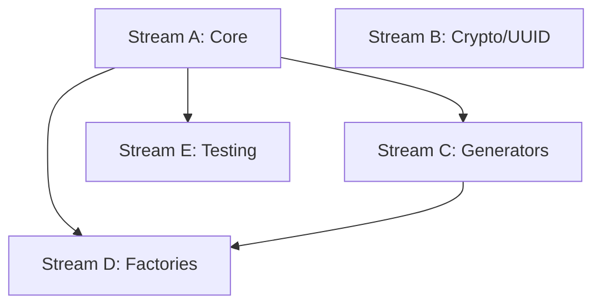

# Task 008 Analysis: Create randomness control utilities

## Current State Assessment

**No Existing Implementation**:

- No randomness control utilities in testkit
- No seed management for reproducible tests
- No UUID/random value mocking
- Green field implementation

## Parallel Streams

### Stream A: Core Random Control

- **Files**: `src/env/random.ts`, `src/env/seed.ts`
- **Work**: Math.random control, seed management, basic random generators
- **Dependencies**: None
- **Estimated Time**: 1 hour

### Stream B: Crypto & UUID Utilities

- **Files**: `src/env/crypto-mock.ts`, `src/env/uuid.ts`
- **Work**: Crypto.randomUUID mocking, deterministic UUIDs, crypto operations
- **Dependencies**: None (parallel with Stream A)
- **Estimated Time**: 1-2 hours

### Stream C: Deterministic Generators

- **Files**: `src/env/generators.ts`, `src/env/sequences.ts`
- **Work**: Predictable data generators (names, emails, IDs), sequence
  generators
- **Dependencies**: Stream A for seeding
- **Estimated Time**: 2 hours

### Stream D: Test Data Factories

- **Files**: `src/env/factories.ts`, `src/env/builders.ts`
- **Work**: Factory patterns for test data, builder patterns with deterministic
  output
- **Dependencies**: Streams A & C
- **Estimated Time**: 2 hours

### Stream E: Testing & Documentation

- **Files**: `src/env/__tests__/random.test.ts`, `docs/randomness.md`
- **Work**: Comprehensive tests, usage docs, examples
- **Dependencies**: Stream A complete
- **Estimated Time**: 1 hour

## Dependencies Graph



## Implementation Details

### Core Random Control (Stream A)

```typescript
export interface RandomContext {
  seed: (value: number | string) => void
  reset: () => void
  next: () => number
  nextInt: (min: number, max: number) => number
  nextFloat: (min: number, max: number) => number
  restore: () => void
}

export function controlRandomness(seed?: number): RandomContext {
  const original = Math.random
  let seedValue = seed ?? Date.now()

  // Replace Math.random with seeded version
  Math.random = createSeededRandom(seedValue)

  return {
    seed: (value) => {
      seedValue = hash(value)
    },
    reset: () => {
      Math.random = createSeededRandom(seedValue)
    },
    next: () => Math.random(),
    nextInt: (min, max) => Math.floor(Math.random() * (max - min + 1)) + min,
    nextFloat: (min, max) => Math.random() * (max - min) + min,
    restore: () => {
      Math.random = original
    },
  }
}
```

### Crypto & UUID (Stream B)

```typescript
export const cryptoMocks = {
  mockRandomUUID: (sequence: string[]) => {
    let index = 0
    vi.spyOn(crypto, 'randomUUID').mockImplementation(() => {
      return sequence[index++ % sequence.length]
    })
  },

  deterministicUUID: (seed: string) => {
    return generateUUIDFromSeed(seed)
  },

  mockRandomValues: (buffer: ArrayBuffer) => {
    vi.spyOn(crypto, 'getRandomValues').mockImplementation((array) => {
      // Fill with deterministic values
      return fillDeterministic(array, buffer)
    })
  },
}
```

### Deterministic Generators (Stream C)

```typescript
export class DeterministicGenerator {
  constructor(private seed: number) {}

  name(): string {
    return NAMES[this.nextIndex(NAMES.length)]
  }

  email(): string {
    return `user${this.nextInt(1000)}@example.com`
  }

  id(): string {
    return `id_${this.seed}_${this.counter++}`
  }

  phone(): string {
    return `555-${this.nextInt(100, 999)}-${this.nextInt(1000, 9999)}`
  }

  choice<T>(array: T[]): T {
    return array[this.nextIndex(array.length)]
  }
}
```

### Test Data Factories (Stream D)

```typescript
export function createFactory<T>(
  generator: (gen: DeterministicGenerator) => T,
): Factory<T> {
  const gen = new DeterministicGenerator(12345)

  return {
    build: (overrides?: Partial<T>) => {
      const base = generator(gen)
      return { ...base, ...overrides }
    },

    buildMany: (count: number, overrides?: Partial<T>) => {
      return Array.from({ length: count }, () => this.build(overrides))
    },

    reset: () => gen.reset(),
  }
}

// Usage
const userFactory = createFactory((gen) => ({
  id: gen.id(),
  name: gen.name(),
  email: gen.email(),
  age: gen.nextInt(18, 80),
}))
```

## File Patterns

```
packages/testkit/
├── src/env/
│   ├── random.ts          [Stream A]
│   ├── seed.ts           [Stream A]
│   ├── crypto-mock.ts    [Stream B]
│   ├── uuid.ts           [Stream B]
│   ├── generators.ts     [Stream C]
│   ├── sequences.ts      [Stream C]
│   ├── factories.ts      [Stream D]
│   ├── builders.ts       [Stream D]
│   └── __tests__/
│       └── random.test.ts [Stream E]
├── docs/
│   └── randomness.md     [Stream E]
└── examples/
    └── deterministic/    [Stream E]
```

## Integration Points

1. **Vitest Mocking**: Integrate with vi.spyOn and vi.fn
2. **Test Lifecycle**: Auto-restore in afterEach
3. **Seed Management**: Per-test or per-suite seeding
4. **Type Safety**: Full TypeScript generics support

## Usage Examples

### Basic Random Control

```typescript
it('should produce deterministic random values', () => {
  const random = controlRandomness(12345)

  const value1 = random.next()
  const value2 = random.next()

  random.reset()
  expect(random.next()).toBe(value1)
  expect(random.next()).toBe(value2)

  random.restore()
})
```

### UUID Mocking

```typescript
it('should use deterministic UUIDs', () => {
  cryptoMocks.mockRandomUUID(['uuid-1', 'uuid-2', 'uuid-3'])

  expect(crypto.randomUUID()).toBe('uuid-1')
  expect(crypto.randomUUID()).toBe('uuid-2')
  expect(crypto.randomUUID()).toBe('uuid-3')
  expect(crypto.randomUUID()).toBe('uuid-1') // Cycles
})
```

### Factory Usage

```typescript
it('should generate consistent test data', () => {
  const factory = userFactory()
  factory.reset()

  const users = factory.buildMany(3)

  factory.reset()
  const users2 = factory.buildMany(3)

  expect(users).toEqual(users2) // Identical
})
```

## Risk Mitigation

- **Risk**: Random state leaking between tests
  - **Mitigation**: Automatic restoration, test isolation
- **Risk**: Incomplete mocking coverage
  - **Mitigation**: Mock all random sources (Math, crypto, Date)
- **Risk**: Non-deterministic in CI
  - **Mitigation**: Fixed seeds in CI, configurable per environment
- **Risk**: Performance overhead
  - **Mitigation**: Lazy initialization, minimal runtime cost

## Success Metrics

- 100% deterministic test runs with same seed
- Support for all random sources
- < 1ms overhead for random control setup
- Zero state leaks between tests
- Reproducible failures via seed logging
