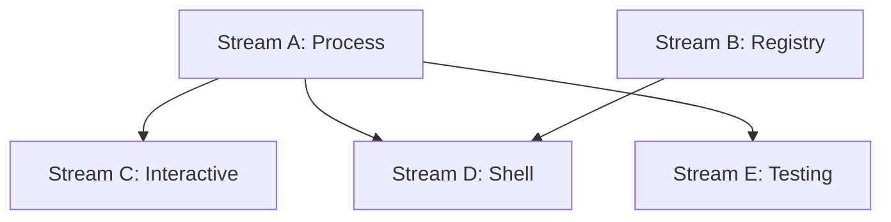

# Task 009 Analysis: Setup CLI command mocking utilities

## Current State Assessment

**No Existing Implementation**:

- No CLI command mocking utilities
- No process spawn/exec mocking
- No shell command interception
- Clean implementation opportunity

## Parallel Streams

### Stream A: Core Process Mocking

- **Files**: `src/cli/process-mock.ts`, `src/cli/spawn.ts`
- **Work**: Mock child_process.spawn, exec, execSync
- **Dependencies**: None
- **Estimated Time**: 1-2 hours

### Stream B: Command Registry

- **Files**: `src/cli/command-registry.ts`, `src/cli/matchers.ts`
- **Work**: Register mock commands, pattern matching, response management
- **Dependencies**: None (parallel with Stream A)
- **Estimated Time**: 1-2 hours

### Stream C: Interactive CLI Testing

- **Files**: `src/cli/interactive.ts`, `src/cli/stdio.ts`
- **Work**: Mock stdin/stdout/stderr, interactive prompts, stream handling
- **Dependencies**: Stream A for process control
- **Estimated Time**: 2 hours

### Stream D: Shell Script Mocking

- **Files**: `src/cli/shell.ts`, `src/cli/scripts.ts`
- **Work**: Mock shell scripts, bash commands, environment variables
- **Dependencies**: Streams A & B
- **Estimated Time**: 1-2 hours

### Stream E: Testing & Documentation

- **Files**: `src/cli/__tests__/*.test.ts`, `docs/cli-mocking.md`
- **Work**: Comprehensive tests, usage documentation
- **Dependencies**: Stream A complete
- **Estimated Time**: 1 hour

## Dependencies Graph



## Implementation Details

### Core Process Mocking (Stream A)

```typescript
export interface ProcessMock {
  stdout: MockStream
  stderr: MockStream
  stdin: MockStream
  exitCode: number
  kill: () => void
  pid: number
}

export function mockChildProcess(): ChildProcessMocker {
  const registry = new Map<string, ProcessMock>()

  vi.spyOn(cp, 'spawn').mockImplementation((command, args, options) => {
    const mock = registry.get(command) ?? createDefaultMock()
    return createMockProcess(mock)
  })

  return {
    register: (command: string, mock: Partial<ProcessMock>) => {
      registry.set(command, { ...createDefaultMock(), ...mock })
    },
    reset: () => registry.clear(),
    restore: () => vi.restoreAllMocks(),
  }
}
```

### Command Registry (Stream B)

```typescript
export class CommandRegistry {
  private commands = new Map<string | RegExp, CommandHandler>()

  register(pattern: string | RegExp, handler: CommandHandler) {
    this.commands.set(pattern, handler)
  }

  match(command: string, args: string[]): CommandResult {
    for (const [pattern, handler] of this.commands) {
      if (this.matches(pattern, command)) {
        return handler(args)
      }
    }
    throw new Error(`No mock registered for: ${command}`)
  }

  mockCommand(command: string) {
    return {
      withArgs: (...args: string[]) => ({
        returns: (output: string, exitCode = 0) => {
          this.register(command, () => ({
            stdout: output,
            stderr: '',
            exitCode,
          }))
        },
        throws: (error: string) => {
          this.register(command, () => ({
            stdout: '',
            stderr: error,
            exitCode: 1,
          }))
        },
      }),
    }
  }
}
```

### Interactive CLI Testing (Stream C)

```typescript
export class InteractiveCLI {
  private stdin = new MockStream()
  private stdout = new MockStream()
  private stderr = new MockStream()

  async sendInput(input: string) {
    this.stdin.write(input + '\n')
  }

  async waitForPrompt(prompt: string | RegExp) {
    return new Promise((resolve) => {
      this.stdout.on('data', (data) => {
        if (this.matches(prompt, data)) {
          resolve(data)
        }
      })
    })
  }

  async interact(script: InteractionScript) {
    for (const step of script) {
      await this.waitForPrompt(step.expect)
      await this.sendInput(step.input)
    }
  }

  getOutput(): { stdout: string; stderr: string } {
    return {
      stdout: this.stdout.getBuffer(),
      stderr: this.stderr.getBuffer(),
    }
  }
}
```

### Shell Script Mocking (Stream D)

```typescript
export const shellMocks = {
  mockScript: (scriptPath: string, behavior: ScriptBehavior) => {
    const registry = CommandRegistry.getInstance()
    registry.register(scriptPath, (args) => {
      return behavior(args)
    })
  },

  mockBashCommand: (command: string, output: string) => {
    vi.spyOn(cp, 'execSync').mockImplementation((cmd) => {
      if (cmd.includes(command)) {
        return Buffer.from(output)
      }
      throw new Error(`Unmocked command: ${cmd}`)
    })
  },

  mockEnvironment: (vars: Record<string, string>) => {
    const original = { ...process.env }
    Object.assign(process.env, vars)
    return () => {
      process.env = original
    }
  },
}
```

## File Patterns

```
packages/testkit/
├── src/cli/
│   ├── process-mock.ts    [Stream A]
│   ├── spawn.ts          [Stream A]
│   ├── command-registry.ts [Stream B]
│   ├── matchers.ts       [Stream B]
│   ├── interactive.ts    [Stream C]
│   ├── stdio.ts         [Stream C]
│   ├── shell.ts         [Stream D]
│   ├── scripts.ts       [Stream D]
│   └── __tests__/
│       └── cli.test.ts   [Stream E]
├── docs/
│   └── cli-mocking.md    [Stream E]
└── examples/
    └── cli-tests/        [Stream E]
```

## Integration Points

1. **Child Process API**: Mock spawn, exec, execSync, fork
2. **Stream Handling**: Mock readable/writable streams
3. **Exit Codes**: Proper process exit code simulation
4. **Signal Handling**: Mock process signals (SIGTERM, SIGKILL)

## Usage Examples

### Basic Command Mocking

```typescript
it('should mock git commands', async () => {
  const cli = mockChildProcess()

  cli.register('git', {
    stdout: 'main\n',
    exitCode: 0,
  })

  const result = await exec('git branch --show-current')
  expect(result.stdout).toBe('main\n')
  expect(result.exitCode).toBe(0)
})
```

### Interactive CLI Testing

```typescript
it('should test interactive prompts', async () => {
  const interactive = new InteractiveCLI()

  const process = interactive.spawn('npm init')

  await interactive.interact([
    { expect: 'package name:', input: 'my-package' },
    { expect: 'version:', input: '1.0.0' },
    { expect: 'description:', input: 'Test package' },
  ])

  const output = interactive.getOutput()
  expect(output.stdout).toContain('package.json created')
})
```

### Command Builder Pattern

```typescript
it('should use fluent API', () => {
  const registry = new CommandRegistry()

  registry.mockCommand('npm').withArgs('test').returns('All tests passed', 0)

  registry
    .mockCommand('npm')
    .withArgs('build')
    .throws('Build failed: TypeScript errors')

  // Tests will use these mocked responses
})
```

## Risk Mitigation

- **Risk**: Process leaks
  - **Mitigation**: Track spawned processes, kill in cleanup
- **Risk**: Stream buffer overflow
  - **Mitigation**: Configurable buffer limits, streaming mode
- **Risk**: Timing issues with async commands
  - **Mitigation**: Promise-based API, proper event handling
- **Risk**: Platform differences (Windows vs Unix)
  - **Mitigation**: Platform-specific command normalization

## Success Metrics

- Zero real processes spawned during tests
- Support for all child_process methods
- Interactive CLI tests < 100ms execution
- No zombie processes after test runs
- Cross-platform compatibility
