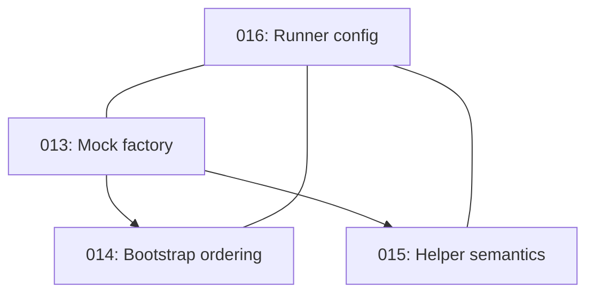

# Task 009 Analysis: Setup CLI command mocking utilities (aligned with 013–016)

## Current State Assessment

Existing implementation in `packages/testkit` provides core CLI mocking:

- `src/cli/process-mock.ts`: end-to-end mocking for spawn, exec, execSync, fork with `MockChildProcess`, global registry, and helpers via `processHelpers`.
- `src/cli/spawn.ts`: higher-level spawn utilities (`spawnUtils`, `commonCommands`, `mockSpawn`, `quickMocks`).

Gaps and risks (addressed by 013–016):

- Runtime delegation is brittle with `vi.mock` hoisting; needs factory-at-mock-time (013).
- Import order must be enforced via bootstrap/setupFiles (014).
- Helper semantics should tri-register by default; `quickMocks` currently reads spawn-centric (015).
- Runner config drift between Vitest and Wallaby; unify setupFiles, env, and CI reporters (016).

## Work Streams (updated)

### Stream A: Mock factory integration (013)

- Files: `packages/testkit/src/cli/process-mock.ts`, `packages/testkit/src/register.ts`, `packages/testkit/src/cli/mock-factory.ts` (new)
- Work: Provide `createChildProcessMock()` and wire `vi.mock(...)` at declaration time in `register.ts`. Remove reliance on late runtime delegation.
- Dependencies: Foundation for 014–015
- Estimate: 8–12h

### Stream B: Bootstrap import order (014)

- Files: `packages/testkit/src/bootstrap.ts` (new), `packages/testkit/src/register.ts`, root `vitest.config.ts`, `wallaby.cjs`
- Work: Ensure bootstrap/register is first in setupFiles for both Vitest and Wallaby; document import pattern and migration.
- Dependencies: A
- Estimate: 6–8h

### Stream C: Helper semantics alignment (015)

- Files: `packages/testkit/src/cli/spawn.ts`, `packages/testkit/src/cli/process-mock.ts`, docs
- Work: Tri-register by default (spawn, exec, execSync); expose narrowing flags; update types and docs.
- Dependencies: A (can run parallel with B once factory shape is known)
- Estimate: 4–6h

### Stream D: Runner config unification (016)

- Files: root `vitest.config.ts`, `packages/testkit/vitest.config.ts`, `wallaby.cjs`
- Work: Single source of truth for setupFiles/env/timeouts; unify CI reporters and outputs to `./test-results/`.
- Dependencies: None (parallel)
- Estimate: 6–8h

## Dependencies Graph



## Implementation Notes (aligned)

### Factory-at-mock-time (013)

- Declare mocks via `vi.mock('child_process', () => createChildProcessMock())` in setupFiles.
- Provide dual-specifier coverage with `vi.mock('node:child_process', ...)` when required.

### Bootstrap ordering (014)

- Ensure `packages/testkit/src/register.ts` (or `bootstrap.ts`) is first in setupFiles for Vitest and honored by Wallaby.
- Document side-effect import pattern for edge cases.

### Helper semantics (015)

- Use `processHelpers` to tri-register spawn/exec/execSync quickly:

```ts
import { processHelpers } from 'packages/testkit/src/cli/process-mock.js'

processHelpers.mockSuccess(/git status/, 'nothing to commit\n')
processHelpers.mockFailure('npm install', 'ERESOLVE', 1)
processHelpers.mockError('pnpm build', new Error('boom'))
```

- Or use the builder API from `spawn.ts` for fluent setup:

```ts
import { mockSpawn } from 'packages/testkit/src/cli/spawn.js'

mockSpawn('docker build -t my:tag').stdout('Successfully built my:tag').exitCode(0).mock()
```

### Runner config unification (016)

- Single source of truth for setupFiles/env; unify CI reporters to `./test-results/`.

## File Patterns (current)

```text
packages/testkit/
├── src/cli/
│   ├── process-mock.ts
│   ├── spawn.ts
│   └── __tests__/
├── src/register.ts
└── docs/
```

## Integration Points

1. Child Process API: spawn, exec, execSync, fork (tri-register by default)
2. Stream handling: stdin/stdout/stderr via `MockStream`
3. Exit codes and signals: simulate exitCode/signal; support kill()
4. Dual specifiers: support `child_process` and `node:child_process`

## Usage Examples

### Basic command mocking (helpers)

```typescript
import { processHelpers } from 'packages/testkit/src/cli/process-mock.js'

processHelpers.mockSuccess('git branch --show-current', 'main\n')
// execSync('git branch --show-current') will return Buffer('main\n')
```

### Builder pattern (spawn)

```typescript
import { mockSpawn } from 'packages/testkit/src/cli/spawn.js'

mockSpawn(/docker run .+/).stdout('OK').exitCode(0).mock()
```

## Risk Mitigation

- `vi.mock` hoisting vs runtime delegation — use factory-at-mock-time (013)
- Import order drift between runners — bootstrap/register first (014)
- Helper spawn-only vs exec paths — tri-register by default (015)
- Config divergence — unify Vitest/Wallaby and CI reporters (016)

## Success Metrics

- All child_process methods covered at declaration time (no late patching)
- Tests pass consistently under Vitest and Wallaby with identical setupFiles order
- Helpers provide deterministic outputs for spawn/exec/execSync
- CI reporters produced at `./test-results/` with no environment-specific flakes
