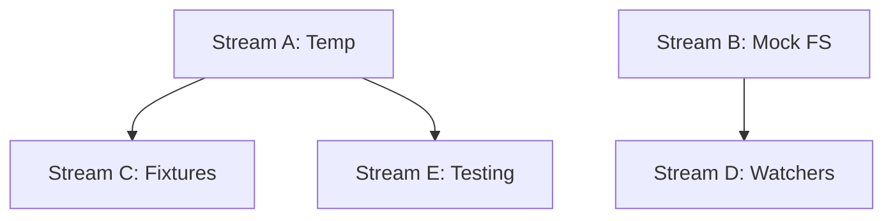

# Task 010 Analysis: Implement file system test utilities

## Current State Assessment

**No Existing Implementation**:

- No file system test utilities in testkit
- No temp directory management
- No file system mocking utilities
- Green field for implementation

## Parallel Streams

### Stream A: Temp Directory Management

- **Files**: `src/fs/temp.ts`, `src/fs/cleanup.ts`
- **Work**: Temp directory creation, automatic cleanup, isolated test
  directories
- **Dependencies**: None
- **Estimated Time**: 1-2 hours

### Stream B: File System Mocking

- **Files**: `src/fs/mock-fs.ts`, `src/fs/virtual.ts`
- **Work**: Virtual file system, in-memory FS operations, fs module mocking
- **Dependencies**: None (parallel with Stream A)
- **Estimated Time**: 2 hours

### Stream C: File Fixtures & Templates

- **Files**: `src/fs/fixtures.ts`, `src/fs/templates.ts`
- **Work**: Load test fixtures, template file generation, snapshot management
- **Dependencies**: Stream A for temp directories
- **Estimated Time**: 1-2 hours

### Stream D: File Watchers & Monitoring

- **Files**: `src/fs/watchers.ts`, `src/fs/events.ts`
- **Work**: Mock file watchers, change detection, event simulation
- **Dependencies**: Stream B for mock FS
- **Estimated Time**: 1-2 hours

### Stream E: Testing & Documentation

- **Files**: `src/fs/__tests__/*.test.ts`, `docs/fs-utilities.md`
- **Work**: Comprehensive tests, usage documentation
- **Dependencies**: Stream A complete
- **Estimated Time**: 1 hour

## Dependencies Graph



## Implementation Details

### Temp Directory Management (Stream A)

```typescript
export interface TempDirectory {
  path: string
  cleanup: () => Promise<void>
  writeFile: (name: string, content: string) => Promise<string>
  mkdir: (name: string) => Promise<string>
  getPath: (name: string) => string
}

export async function createTempDirectory(
  prefix = 'test-',
): Promise<TempDirectory> {
  const basePath = await fs.mkdtemp(path.join(os.tmpdir(), prefix))

  return {
    path: basePath,
    cleanup: async () => {
      await fs.rm(basePath, { recursive: true, force: true })
    },
    writeFile: async (name, content) => {
      const filePath = path.join(basePath, name)
      await fs.mkdir(path.dirname(filePath), { recursive: true })
      await fs.writeFile(filePath, content)
      return filePath
    },
    mkdir: async (name) => {
      const dirPath = path.join(basePath, name)
      await fs.mkdir(dirPath, { recursive: true })
      return dirPath
    },
    getPath: (name) => path.join(basePath, name),
  }
}

// Automatic cleanup integration
export function useTempDirectory(): TempDirectory {
  let temp: TempDirectory

  beforeEach(async () => {
    temp = await createTempDirectory()
  })

  afterEach(async () => {
    await temp?.cleanup()
  })

  return temp
}
```

### File System Mocking (Stream B)

```typescript
export class VirtualFileSystem {
  private files = new Map<string, Buffer | string>()
  private dirs = new Set<string>()

  writeFileSync(path: string, content: string | Buffer) {
    this.ensureDir(path.dirname(path))
    this.files.set(path, content)
  }

  readFileSync(path: string): string | Buffer {
    if (!this.files.has(path)) {
      throw new Error(`ENOENT: no such file or directory, open '${path}'`)
    }
    return this.files.get(path)!
  }

  existsSync(path: string): boolean {
    return this.files.has(path) || this.dirs.has(path)
  }

  mkdirSync(path: string, options?: { recursive?: boolean }) {
    if (options?.recursive) {
      this.ensureDir(path)
    } else if (this.dirs.has(path)) {
      throw new Error(`EEXIST: file already exists, mkdir '${path}'`)
    }
    this.dirs.add(path)
  }

  readdirSync(path: string): string[] {
    if (!this.dirs.has(path)) {
      throw new Error(`ENOENT: no such file or directory, scandir '${path}'`)
    }
    // Return files and dirs in path
    return Array.from(this.files.keys())
      .filter((f) => f.startsWith(path + '/'))
      .map((f) => f.slice(path.length + 1).split('/')[0])
      .concat(
        Array.from(this.dirs)
          .filter((d) => d.startsWith(path + '/'))
          .map((d) => d.slice(path.length + 1).split('/')[0]),
      )
      .filter(Boolean)
      .filter((v, i, a) => a.indexOf(v) === i) // unique
  }

  mount() {
    vi.spyOn(fs, 'writeFileSync').mockImplementation(
      this.writeFileSync.bind(this),
    )
    vi.spyOn(fs, 'readFileSync').mockImplementation(
      this.readFileSync.bind(this),
    )
    vi.spyOn(fs, 'existsSync').mockImplementation(this.existsSync.bind(this))
    vi.spyOn(fs, 'mkdirSync').mockImplementation(this.mkdirSync.bind(this))
    vi.spyOn(fs, 'readdirSync').mockImplementation(this.readdirSync.bind(this))
  }

  unmount() {
    vi.restoreAllMocks()
  }
}
```

### File Fixtures & Templates (Stream C)

```typescript
export class FixtureLoader {
  constructor(private basePath: string) {}

  async load(fixtureName: string): Promise<string> {
    const fixturePath = path.join(this.basePath, 'fixtures', fixtureName)
    return await fs.readFile(fixturePath, 'utf-8')
  }

  async loadJSON<T>(fixtureName: string): Promise<T> {
    const content = await this.load(fixtureName)
    return JSON.parse(content)
  }

  async copyFixture(fixtureName: string, destPath: string) {
    const content = await this.load(fixtureName)
    await fs.writeFile(destPath, content)
  }

  async createFromTemplate(
    templateName: string,
    variables: Record<string, string>,
    destPath: string,
  ) {
    let content = await this.load(`templates/${templateName}`)

    for (const [key, value] of Object.entries(variables)) {
      content = content.replace(new RegExp(`{{${key}}}`, 'g'), value)
    }

    await fs.writeFile(destPath, content)
  }
}
```

### File Watchers & Monitoring (Stream D)

```typescript
export class MockFileWatcher {
  private watchers = new Map<
    string,
    Set<(event: string, filename: string) => void>
  >()

  watch(filename: string, callback: (event: string, filename: string) => void) {
    if (!this.watchers.has(filename)) {
      this.watchers.set(filename, new Set())
    }
    this.watchers.get(filename)!.add(callback)

    return {
      close: () => {
        this.watchers.get(filename)?.delete(callback)
      },
    }
  }

  trigger(filename: string, event: 'change' | 'rename' | 'delete') {
    const callbacks = this.watchers.get(filename)
    if (callbacks) {
      callbacks.forEach((cb) => cb(event, filename))
    }
  }

  mount() {
    vi.spyOn(fs, 'watch').mockImplementation((filename, callback) => {
      return this.watch(filename.toString(), callback as any)
    })
  }

  unmount() {
    vi.restoreAllMocks()
    this.watchers.clear()
  }
}
```

## File Patterns

```
packages/testkit/
├── src/fs/
│   ├── temp.ts          [Stream A]
│   ├── cleanup.ts       [Stream A]
│   ├── mock-fs.ts       [Stream B]
│   ├── virtual.ts       [Stream B]
│   ├── fixtures.ts      [Stream C]
│   ├── templates.ts     [Stream C]
│   ├── watchers.ts      [Stream D]
│   ├── events.ts        [Stream D]
│   └── __tests__/
│       └── fs.test.ts    [Stream E]
├── fixtures/            [Stream C]
│   └── test-data/
├── docs/
│   └── fs-utilities.md  [Stream E]
└── examples/
    └── fs-tests/        [Stream E]
```

## Integration Points

1. **Node FS Module**: Mock all fs and fs/promises methods
2. **Path Resolution**: Handle relative and absolute paths
3. **Platform Compatibility**: Windows/Unix path handling
4. **Cleanup Hooks**: Integrate with test lifecycle

## Usage Examples

### Temp Directory Usage

```typescript
it('should create isolated test directory', async () => {
  const temp = await createTempDirectory('my-test-')

  await temp.writeFile('config.json', '{"test": true}')
  const configPath = temp.getPath('config.json')

  expect(await fs.readFile(configPath, 'utf-8')).toBe('{"test": true}')

  await temp.cleanup() // Removes everything
})
```

### Virtual File System

```typescript
it('should use virtual file system', () => {
  const vfs = new VirtualFileSystem()
  vfs.mount()

  fs.writeFileSync('/app/config.json', '{"mock": true}')
  const content = fs.readFileSync('/app/config.json', 'utf-8')

  expect(content).toBe('{"mock": true}')
  expect(fs.existsSync('/app/config.json')).toBe(true)

  vfs.unmount()
})
```

### File Watcher Mocking

```typescript
it('should mock file watchers', () => {
  const watcher = new MockFileWatcher()
  watcher.mount()

  const callback = vi.fn()
  const handle = fs.watch('/app/config.json', callback)

  watcher.trigger('/app/config.json', 'change')
  expect(callback).toHaveBeenCalledWith('change', '/app/config.json')

  handle.close()
  watcher.unmount()
})
```

## Risk Mitigation

- **Risk**: Temp directory leaks
  - **Mitigation**: Automatic cleanup in afterEach, global teardown
- **Risk**: File permission issues
  - **Mitigation**: Proper error handling, fallback strategies
- **Risk**: Platform path differences
  - **Mitigation**: Use path.join, normalize paths
- **Risk**: Race conditions in async operations
  - **Mitigation**: Proper promise handling, sequential operations

## Success Metrics

- Zero temp directories left after test runs
- Virtual FS operations < 1ms
- Support for all common fs operations
- Cross-platform compatibility
- Automatic cleanup in all scenarios
