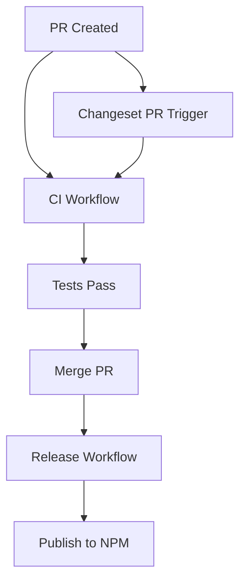

# GitHub Workflows Documentation

## Workflows Overview

### CI Workflow (`ci.yml`)
Main CI pipeline that runs on all PRs and pushes to main/develop branches.

**Triggers:**
- Pull requests (all branches)
- Pushes to main, develop, and changeset-release branches
- Manual workflow dispatch

### Release Workflow (`release.yml`)
Handles package releases using changesets.

**Triggers:**
- Pushes to main branch
- Manual workflow dispatch

### Changeset PR Trigger (`changeset-pr-trigger.yml`)
Ensures CI runs on changeset release PRs created by bots.

**Why this exists:**
GitHub Actions bot-created PRs sometimes don't trigger CI workflows automatically. This workflow detects when a changeset release PR is created without CI checks and triggers them by pushing an empty commit.

**How it works:**
1. Detects PRs created by `github-actions[bot]` from `changeset-release/*` branches
2. Checks if CI is already running
3. If not, pushes an empty commit to trigger CI
4. Comments on the PR to notify about the action

### Weekly Paranoid Tests (`weekly-paranoid.yml`)
Comprehensive weekly testing suite for deep validation.

**Includes:**
- Full coverage analysis
- Stress testing
- Concurrency testing
- Memory leak detection
- Turbo cache analysis

### Nightly Performance Benchmarks (`nightly-performance.yml`)
Currently disabled - runs performance benchmarks and creates issues if regressions detected.

## Common Issues and Solutions

### Issue: Changeset Release PR has no CI checks
**Solution:** The `changeset-pr-trigger.yml` workflow automatically handles this. If needed manually:
```bash
# Push an empty commit to the changeset branch
git checkout changeset-release/main
git commit --allow-empty -m "chore: trigger CI"
git push
```

### Issue: CI not triggering on PR
**Solutions:**
1. Close and reopen the PR
2. Push an empty commit
3. Check if branch protection rules are blocking

## Workflow Dependencies



## Environment Variables

### Required Secrets
- `NPM_TOKEN` - For publishing packages
- `TURBO_TOKEN` - For Turbo remote cache
- `TURBO_TEAM` - Turbo team identifier
- `TURBO_REMOTE_CACHE_SIGNATURE_KEY` - For cache signing

### Workflow Permissions
Most workflows require:
- `contents: read`
- `pull-requests: write` (for commenting)
- `checks: write` (for test reports)
- `id-token: write` (for NPM provenance)