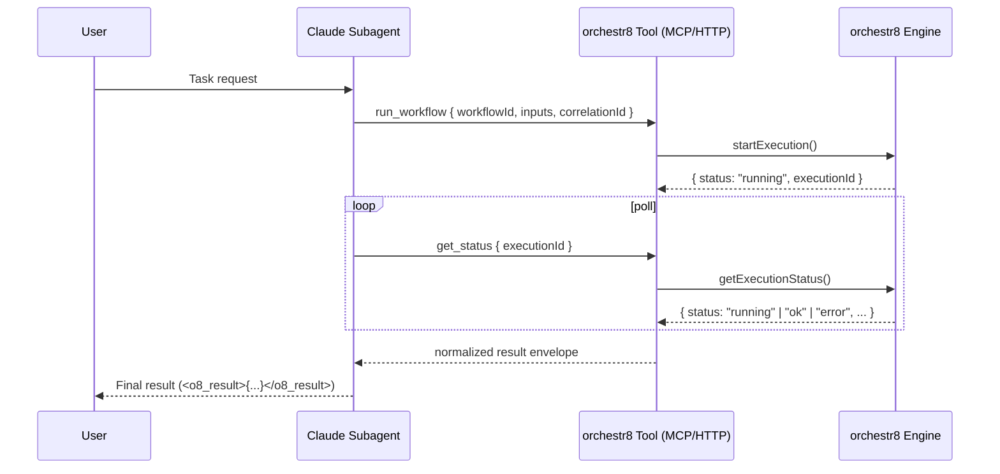

# Claude subagents ↔ orchestr8 integration

Status: Implementation Specifications Complete
Updated: 2025-01-19

## Summary

Integration is structured across two complementary specifications:

1. **MCP Integration** (@.agent-os/specs/2025-01-18-mcp-integration/):
   - Model Context Protocol server providing tools and resources
   - Defines tool schemas, capabilities, and normalized envelope

2. **Claude Subagents Integration** (@.agent-os/specs/2025-01-18-claude-subagents-integration/):
   - Claude-specific features (prompt caching, JSON output mode)
   - HTTP REST API mirroring MCP functionality for CI/CD
   - Parity testing between surfaces

## Why this matters

- Dev velocity: Run orchestrated dev agents directly from Claude Code or CI.
- Governance: Apply orchestr8 resilience, limits, and structured logs to LLM work.
- Dual deployment: Same behavior whether invoked as a Claude tool or a service.

## Collaboration model in Claude Code

- Discovery: Each persona is a markdown file in `.claude/agents`.
- Handoff: Agents invite each other by name within one chat; no agent-as-tool.
- Shared tools: All collaborating agents list the same `orchestr8` tool (MCP/HTTP).
- State: Conversation is shared in Claude; structured state lives in orchestr8 (executionId + correlationId).

## Architecture overview

- Claude → orchestr8 (recommended): Subagents call the `orchestr8` tool (MCP preferred). The tool runs workflows and returns a normalized envelope.
- orchestr8 → Claude (optional): Orchestr8 calls Claude roles via an adapter when the LLM should run outside Claude Code.
- Determinism: Orchestr8 executes the business logic; Claude personas provide UX and intent routing.



## Specifications Reference

### Core Specifications

- **Normalized Result Envelope**: @.agent-os/specs/2025-01-18-mcp-integration/sub-specs/normalized-envelope.md
- **MCP Protocol API**: @.agent-os/specs/2025-01-18-mcp-integration/sub-specs/api-spec.md
- **HTTP REST API**: @.agent-os/specs/2025-01-18-claude-subagents-integration/sub-specs/api-spec.md

### Tool Actions (Claude → orchestr8)

The MCP server provides three tools (see MCP API spec for full schemas):

- **run_workflow**: Execute workflows with resilience patterns
  - Inputs: workflowId, inputs, options, correlationId
  - Supports long-polling via waitForMs parameter
- **get_status**: Monitor execution status
  - Inputs: executionId, waitForMs, correlationId
  - Returns current state or waits for completion
- **cancel_workflow**: Cancel running executions
  - Inputs: executionId, reason, correlationId
  - Returns confirmation or error

MCP tool naming in Claude Code follows the pattern `mcp__{serverId}__{tool}`.
With serverId `io.orchestr8`, the three tools will appear to the assistant as:

- `mcp__io.orchestr8__run_workflow`
- `mcp__io.orchestr8__get_status`
- `mcp__io.orchestr8__cancel_workflow`

Per Anthropic’s MCP connector, Claude will emit `mcp_tool_use` blocks when it
decides to call these, and the client must respond with `mcp_tool_result` blocks
containing the normalized envelope or an error (set `is_error: true`) to prompt
retry with corrected inputs.

### HTTP endpoints (reference)

- POST `/api/workflows/run` → `{ executionId, status: "running", correlationId }`
- GET `/api/workflows/status/{executionId}` → normalized envelope
- POST `/api/workflows/cancel/{executionId}` → `{ status: "ok" | "error", ... }`

Auth: Bearer/OIDC in headers only. Never echo secrets.

Error model:

```json
{
  "error": {
    "code": "TIMEOUT",
    "message": "exceeded 300000ms",
    "retryable": true
  }
}
```

## Claude subagent templates

Place each persona in `.claude/agents`. All list the same orchestr8 MCP tools
by full name (see above pattern).

```markdown
---
name: orchestr8-bridge
description: Bridge to orchestr8 workflows via MCP. Use correlationId and return a normalized envelope.
tools: mcp__io.orchestr8__run_workflow, mcp__io.orchestr8__get_status, mcp__io.orchestr8__cancel_workflow
---

You invoke the `orchestr8` tool to run workflows and return ONLY:

<o8_result>{ "status": "...", "executionId": "...", "workflowId": "...", "data": { ... }, "correlationId": "..." }</o8_result>

Steps:

- Choose workflowId + inputs.
- Generate or reuse correlationId.
- Call mcp**orchestr8**run_workflow; if status is running, poll
  mcp**orchestr8**get_status until ok/error.
- Redact secrets; keep outputs concise.

MCP semantics:

- If a tool call fails validation or is incomplete, return an `mcp_tool_result`
  with `is_error: true` and a short message; Claude will retry with improved
  inputs per Anthropic’s tool-use guidance.
- Prefer concise, structured envelopes over free text; do not summarize or
  transform the envelope content.
```

Coordinator persona (handoff model):

```markdown
---
name: dev-coordinator
description: Coordinates typescript-pro and react-pro personas; all execution via orchestr8.
tools: mcp__io.orchestr8__run_workflow, mcp__io.orchestr8__get_status, mcp__io.orchestr8__cancel_workflow
---

Rules:

- Invite subagents by name when needed.
- Reuse the same correlationId across all tool calls.
- Never implement business logic; delegate to orchestr8 workflows.
- Output only <o8_result>{...}</o8_result>.
```

## Orchestr8 adapters (scaffolding)

MCP server action handlers (validate with Zod inside orchestr8):

```ts
// filepath: packages/agent-adapters/mcp/src/server.ts
import { z } from 'zod'

const RunWorkflowInput = z.object({
  action: z.literal('run_workflow'),
  workflowId: z.string().min(1),
  inputs: z.record(z.any()),
  options: z
    .object({
      timeoutMs: z.number().int().nonnegative().optional(),
      concurrency: z.number().int().min(1).optional(),
      resilience: z.record(z.any()).optional(),
    })
    .optional(),
  correlationId: z.string().optional(),
})

export async function handleRunWorkflow(raw: unknown) {
  const input = RunWorkflowInput.parse(raw)
  // ... call engine.startExecution(input.workflowId, input.inputs, input.options)
  return {
    status: 'running',
    executionId: 'exec_xxx',
    workflowId: input.workflowId,
    correlationId: input.correlationId ?? 'o8-' + crypto.randomUUID(),
  }
}
```

Claude adapter (orchestr8 → Claude; thin wrapper):

```ts
// filepath: packages/agent-adapters/claude/src/adapter.ts
import { Anthropic } from '@anthropic-ai/sdk'
import { z } from 'zod'

export interface ClaudeAdapterOptions {
  model: string
  maxTokens?: number
}

export interface ClaudeAdapterContext {
  correlationId: string
}

export class ClaudeAdapter {
  private client: Anthropic
  private opts: ClaudeAdapterOptions

  constructor(apiKey: string, opts: ClaudeAdapterOptions) {
    this.client = new Anthropic({ apiKey })
    this.opts = opts
  }

  async generate(
    prompt: string,
    ctx: ClaudeAdapterContext,
    signal?: AbortSignal,
  ): Promise<{
    text: string
    cost?: { inputTokens?: number; outputTokens?: number }
  }> {
    const res = await this.client.messages.create(
      {
        model: this.opts.model,
        max_tokens: this.opts.maxTokens ?? 1024,
        messages: [{ role: 'user', content: prompt }],
        metadata: { correlation_id: ctx.correlationId },
      },
      { signal },
    )
    const text =
      res.content?.map((c) => ('text' in c ? c.text : '')).join('') ?? ''
    return { text }
  }
}
```

## Streaming, cancellation, and limits

- Streaming: Stream deltas to orchestr8 structured logs; aggregate for `data`.
- Cancellation: Map AbortSignal to Claude SDK and engine cancellation.
- Limits: Propagate engine evaluator depth/size/timeouts; enforce max payload size; redact large logs.

Notes aligned with Anthropic docs:

- When using tool calling, accumulate `input_json_delta` fragments during
  streaming and emit a single tool input object on `content_block_stop`.
- In Claude Code MCP sessions, tool calls are surfaced as `mcp_tool_use` and
  results as `mcp_tool_result`; do not inject business logic between them—just
  call the orchestr8 engine and return the normalized envelope.

## Security

- Secrets: Header-based auth for HTTP; MCP tool permissions for local. Never print tokens.
- Env allowlist: Single source (schema-level recommended) applied by both adapters.
- Prototype pollution guards and key blacklists in expression resolution are retained.

MCP permissions & allowlisting:

- Declare explicit allowed tools (e.g. via `--allowedTools` in CLI or persona
  config) using the full names `mcp__io.orchestr8__...` to prevent unintended tool
  access.

## Observability

- Correlation: Include `correlationId` across tool calls and engine logs; attach `executionId` when available.
- Metrics: latency, retries, error codes, token costs.
- Structured logs: stepId, workflowId, status, truncated flags, sizes.

Prompt caching (optional):

- For direct Claude API usage (outside Claude Code MCP), cache stable, large
  system prefixes using `cache_control: { type: 'ephemeral' }` to reduce token
  costs. Tool definitions can be cached by applying cache control to the last
  tool in the list (per Anthropic guidance). MCP tool lists inside Claude Code
  are managed by the host and typically not controlled here.

## Testing and parity

- Contract tests ensure identical envelopes via MCP and HTTP.
- Unit tests for:
  - Input validation (Zod) and error normalization.
  - Cancellation/timeouts honoring resilience policies.
  - Envelope shape stability and secret redaction.
- Prefer Vitest and Wallaby.js for local feedback.

Also add tests for error tool flows:

- When `run_workflow` is invoked with invalid inputs, the MCP path should return
  an `mcp_tool_result` with `is_error: true`, and the HTTP path should return a
  normalized error envelope. Parity assertions should compare structures.

```ts
// filepath: packages/agent-adapters/claude/__tests__/envelope-parity.test.ts
import { describe, it, expect } from 'vitest'

describe('orchestr8 envelope parity', () => {
  it('matches shape for MCP vs HTTP', async () => {
    // ... call mock MCP handler and HTTP controller with same inputs
    const mcp = {
      status: 'ok',
      executionId: 'e1',
      workflowId: 'w',
      data: {},
      correlationId: 'c',
    }
    const http = {
      status: 'ok',
      executionId: 'e1',
      workflowId: 'w',
      data: {},
      correlationId: 'c',
    }
    expect(http).toStrictEqual(mcp)
  })
})
```

## Risks and mitigations

- MCP runtime dependency → watchdog/reconnect, version pinning, health action.
- HTTP security drift → headers-only auth, strict redaction, structured error model.
- Adapter drift → parity tests on the normalized envelope and behaviors.
- Cost/rate limits → budgets, max turns, token caps by workflow.

Non-goals (to avoid re-implementing orchestr8 in adapters):

- No business logic, evaluation, retries, or resilience in MCP/HTTP/Claude
  adapters; these components only validate inputs, forward to the engine, and
  map responses to the normalized envelope.
- No per-adapter state machines; execution state is owned by the engine.
- No secret echoing or payload expansion; redact and bound outputs.

## Roadmap

- Phase 1 (PoC): MCP server (`run_workflow/get_status/cancel_workflow`), HTTP mirror, one `.claude/agents/orchestr8-bridge.md`, parity tests.
- Phase 2 (Hardening): Cancellation, resilience coverage, env whitelist unification, cost reporting, docs.
- Phase 3 (Dev Agents): Seed TypeScript/React/Next agents, example workflows, examples in docs.

## Acceptance criteria

- Identical normalized envelopes via MCP and HTTP, including correlation IDs.
- Cancellable executions with proper status transitions.
- No secret leakage; logs are structured and bounded.
- Single agent code path; adapters contain no business logic and only call
  orchestr8 engine APIs.

---
